# Bản đồ Kiến trúc & Luồng Hoạt động — DMS Frontend

> **Cập nhật lần cuối:** 2026-03-29  
> **Phạm vi:** `DiQuaMuaHaa/frontend/demothuattoanpro/src/`

---

## Sơ đồ Luồng End-to-End (Mermaid)

```mermaid
flowchart TD
    subgraph BOOT["🚀 GIAI ĐOẠN KHỞI TẠO (Mount)"]
        A([User mở browser]) --> B[App.jsx render route '/']
        B --> C[DriverMonitorDMS\ndms/index.jsx mount]
        C --> D1[useDriverAlerts\nĐăng ký setInterval 250ms\nPERMANENT]
        C --> D2[useDmsSocket\nio.connect → API_BASE\nSocket.IO handshake]
        C --> D3[useDriverAI\nloadScript MEDIAPIPE_CDN\nnew FaceMesh + setOptions]
        C --> D4[status = 'idle'\nCameraStateOverlay hiển thị\nnút Activate Camera]
    end

    subgraph AUTH["🔐 GIAI ĐOẠN XÁC THỰC DANH TÍNH"]
        D4 --> E1[User click Activate Camera]
        E1 --> E2[startWebcam\nuseCamera.js\ngetUserMedia 640x480]
        E2 -- "stream OK" --> E3[videoRef.srcObject = stream\nstatus = 'auth']
        E2 -- "error" --> E4[status = 'error'\nCameraStateOverlay: Retry]
        E3 --> E5[OwnerVerifyGate\nPOST /api/identity/verify\nmỗi 1200ms]
        E5 --> E6{handleUpdateIdentity\nidentityOwner?}
        E6 -- "OWNER ≥ 2 frames" --> E7[handleIdentityUnlock\nfetch /api/identity/driver_profile\nstatus = 'active'\nspeakOwnerGreeting]
        E6 -- "INTRUDER ≥ 3 frames" --> E8[handleIdentityLock\nstatus = 'locked'\nTelegramOwnerRejectOverlay]
        E7 --> E9[startDrivingSession\nPOST /api/driving_session/start]
    end

    subgraph REALTIME["⚡ GIAI ĐOẠN XỬ LÝ REAL-TIME (status = active)"]
        direction TB
        E7 --> F1

        subgraph FACEMESH["MediaPipe Loop ~30fps"]
            F1[useDriverAI RAF loop\nnow - last ≥ 33ms] --> F2[fm.send imagevideoRef]
            F2 --> F3[FaceMesh.onResults callback\n468 landmarks]
            F3 --> F4A[estimateHeadPose\nposeRef.current]
            F3 --> F4B[computeEAR L_EYE R_EYE\neyeDataRef.current\nearHistoryRef.current]
            F3 --> F4C[computePupilRadius\npupilR]
            F3 --> F4D[isBlinkL AND isBlinkR?\neyesClosedSinceRef\neyesClosedSecRef += dt]
            F1 -. "loop RAF" .-> F1
        end

        subgraph SOCKET["WebSocket Loops"]
            G1[useDmsSocket RAF ~15fps\nphone_frame emit\nJPEG 320x240] --> G2[Flask YOLO\nphone_result event]
            G2 --> G3[Hysteresis filter\nPHONE_STABLE_FRAMES=4\nPHONE_OFF_FRAMES=6\nphoneDetectionRef]
            G4[useDmsSocket RAF ~4fps\nsmoking_frame emit\nJPEG full] --> G5[Flask MediaPipe\nsmoking_result event]
            G5 --> G6[Hysteresis filter\nSMOKING_STABLE_FRAMES=10\nsmokingDetectionRef]
            G1 -. "loop RAF" .-> G1
            G4 -. "loop RAF" .-> G4
        end

        subgraph HTTP_POLL["HTTP Poll ~1s"]
            H1[fetch /api/analyze_frame\nLandmark JSON] --> H2[Flask MLPClassifier\nlabel + prob]
            H2 --> H3[apiLabelRef.current\napiLabelStreakRef]
        end
    end

    subgraph ALERT["🚨 GIAI ĐOẠN CẢNH BÁO (setInterval 250ms)"]
        I1[useDriverAlerts\nInterval 250ms] --> I2[Sync displayPose\ndisplayEye → setState\nRe-render Head3D / EyeCanvas]

        I1 --> I3{eyesClosedSecRef ≥ 3s\nOR apiStreak ≥ 5?}
        I3 -- "YES" --> I4[setDrowsyAlert\nstartAlarm\nWeb Audio beep + vibrate]
        I4 --> I5[DrowsyAlertOverlay render\nfull-screen overlay z:20]
        I4 --> I6[useEffect detects\nnull → non-null\nrecordDrivingAlert\nPOST /api/driving_session/alert]

        I1 --> I7{phoneSecRef ≥ 3s?}
        I7 -- "YES" --> I8[setPhoneAlert\nstartAlarm]
        I8 --> I9[PhoneAlertOverlay render\nPhoneFOMOOverlay canvas]
        I8 --> I10[recordDrivingAlert 'phone']

        I1 --> I11{smokingSecRef ≥ 4s?}
        I11 -- "YES" --> I12[setSmokingAlert\nstartAlarm]
        I12 --> I13[SmokingAlertOverlay render\nSmokingFOMOOverlay canvas]
        I12 --> I14[recordDrivingAlert 'smoking']
    end

    subgraph OVERLAYS["🎨 RAF OVERLAYS 60fps (luôn chạy, chỉ đọc refs)"]
        J1[FaceMeshOverlay\nlandmarksRef → canvas]
        J2[PhoneFOMOOverlay\nphoneDetectionRef → bbox canvas]
        J3[EyeCanvas\neyeDataRef → animated eye]
        J4[WaveformCanvas\nearHistoryRef → bar chart]
        J5[Head3D Three.js\nposeRef → yaw pitch roll]
    end

    F4A -.-> J5
    F4B -.-> J1 & J3 & J4
    G3 -.-> J2

    subgraph SESSION_END["🏁 KẾT THÚC PHIÊN"]
        K1[User click Stop\nstopWebcam] --> K2[streamRef tracks stop\nstatus = idle\nAll refs reset]
        K2 --> K3[endDrivingSession\nPOST /api/driving_session/end]
    end

    style BOOT fill:#0a1e35,stroke:#1e5fc0
    style AUTH fill:#0a2a1e,stroke:#00a060
    style REALTIME fill:#1a0a2e,stroke:#7040c0
    style ALERT fill:#2e0a0a,stroke:#c04040
    style OVERLAYS fill:#0a1e2e,stroke:#204080
    style SESSION_END fill:#1e1e0a,stroke:#808020
```



---

## Giai đoạn 1 — Khởi tạo (Mounting)

**Thứ tự thực thi khi component mount:**

| # | Hook / Effect | File thực tế | Ghi chú |
|---|---|---|---|
| 1 | `useDriverAlerts` → `setInterval(250ms)` | `dms/hooks/useDriverAlerts.js` | Chạy **ngay lập tức**, không đợi camera. Permanent loop |
| 2 | `useDmsSocket` → `io(API_BASE)` | `dms/hooks/useDmsSocket.js` | Socket.IO connect ngay, `wsConnected = true` khi handshake xong |
| 3 | `useDriverAI` → `loadScript(MEDIAPIPE_CDN)` | `dms/hooks/useDriverAI.js` | Load JS CDN → `new window.FaceMesh()` → `fm.setOptions()` → `faceMeshRef.current` |
| 4 | `warmSpeechVoices()` | `utils/speakOwnerGreeting.js` | Pre-load Web Speech API voices |
| 5 | `localStorage.getItem(DRIVER_ID_KEY)` | `dms/index.jsx` | Khôi phục `driverId` từ lần trước |
| 6 | `VoiceCarAssistant` mount | `voice/VoiceCarAssistant.jsx` | `enabled=false` → passive standby |
| 7 | `OwnerVerifyGate` mount | `systeamdetectface/OwnerVerifyGate.jsx` | `enabled=false` → standby |

**Kết quả:** `status = "idle"` → `CameraStateOverlay` hiển thị nút **Activate Camera**.

---

## Giai đoạn 2 — Xử lý Real-time (Processing)

Khi `status = "active"`, **3 vòng lặp song song** chạy độc lập:

---

### Vòng lặp A — MediaPipe Face Analysis (`~30fps`)

```
useDriverAI.js — RAF loop (FACE_MESH_INTERVAL_MS ≈ 33ms)
    ↓ fm.send({ image: videoRef.current })
    ↓ FaceMesh.onResults(results) callback
    ↓
    ├── estimateHeadPose(lm)
    │     └─► poseRef.current = { yaw, pitch, roll }       [đọc bởi Head3D @60fps]
    │
    ├── computeEAR(lm, L_EYE) + computeEAR(lm, R_EYE)
    │     công thức: (‖p2-p6‖ + ‖p3-p5‖) / (2 × ‖p1-p4‖)
    │     └─► eyeDataRef.current = { left:{ear,blinking}, right:{ear,blinking} }
    │         earHistoryRef.current.left/right (90 điểm)   [đọc bởi WaveformCanvas]
    │
    ├── computePupilRadius(lm, L_EYE.iris)
    │     └─► eyeDataRef.current.left.pupilR
    │
    └── Drowsy timer:
          if earL < EAR_BLINK_THRESH(0.21) AND earR < 0.21
              eyesClosedSinceRef.current = now (timestamp)
          eyesClosedSecRef.current = (now - start) / 1000   [đọc bởi useDriverAlerts]
```

> **Thiết kế quan trọng:** `onResults` chỉ ghi vào **refs** (không `setState`)  
> → Không trigger React re-render → overlays đọc ở 60fps mà không gây lag.

---

### Vòng lặp B — Phone Detection qua WebSocket (`~15fps`)

```
useDmsSocket.js — RAF loop (PHONE_WS_FPS = 15)
    ↓ canvas 320×240.toDataURL("image/jpeg", 0.6)
    ↓ socket.emit("phone_frame", { image, driver_id })
    ↓ Flask YOLO11 xử lý
    ↓ socket.on("phone_result", { boxes: [{x,y,w,h,prob},...] })
    ↓ Lọc bbox: size [PHONE_BOX_MIN_SIZE, PHONE_BOX_MAX_SIZE] + motion check
    ↓ Hysteresis: PHONE_STABLE_FRAMES=4 bật / PHONE_OFF_FRAMES=6 tắt
    └─► phoneDetectionRef.current = { active, prob, bbox }  [đọc bởi PhoneFOMOOverlay]
```

---

### Vòng lặp C — Smoking Detection qua WebSocket (`~4fps`)

```
useDmsSocket.js — RAF loop (SMOKING_WS_FPS = 4)
    ↓ canvas full-res.toDataURL("image/jpeg", 0.7)
    ↓ socket.emit("smoking_frame", { image, driver_id })
    ↓ Flask MediaPipe hand/face → MLPClassifier
    ↓ socket.on("smoking_result", { label, prob })
    ↓ Hysteresis: SMOKING_STABLE_FRAMES=10 bật / SMOKING_OFF_FRAMES=14 tắt
    └─► smokingDetectionRef.current = { active, prob }      [đọc bởi useDriverAlerts]
```

---

## Giai đoạn 3 — Cảnh báo (Alert & API)

Mỗi `ALERT_INTERVAL_MS = 250ms`, `useDriverAlerts.js` chạy 4 việc:

```
setInterval callback (useDriverAlerts.js):
  │
  ├─ [1] Sync UI state (re-render nhẹ)
  │       poseRef       → setDisplayPose()  → Head3D cập nhật góc
  │       eyeDataRef    → setDisplayEye()   → EyeCanvas / WaveformCanvas
  │
  ├─ [2] Drowsy Timer — kết hợp 2 nguồn độc lập
  │       Client: eyesClosedSecRef.current >= EYES_CLOSED_WARN_MS / 1000  (3s)
  │       Server: apiLabelRef = "drowsy"/"yawning" ≥ API_STREAK_TRIGGER (5) lần liên tục
  │       ──────────────────────────────────────────────────────────────
  │       → setDrowsyAlert(closedSec)
  │       → startAlarm() [880Hz square wave + navigator.vibrate([200,100,200])]
  │       → DrowsyAlertOverlay mount (zIndex: 20)
  │
  ├─ [3] Phone Timer
  │       phoneDetectionRef.active → phoneSinceRef tracking
  │       phoneSinceRef >= PHONE_WARN_MS / 1000  (3s)
  │       → setPhoneAlert(sec)
  │       → PhoneAlertOverlay mount (zIndex: 19) + PhoneFOMOOverlay canvas bbox
  │
  └─ [4] Smoking Timer
          smokingDetectionRef.active → smokingSinceRef tracking
          smokingSinceRef >= SMOKING_WARN_MS / 1000  (4s)
          → setSmokingAlert(sec)
          → SmokingAlertOverlay mount (zIndex: 18)
```

**Ghi log về Flask khi alert bật lần đầu (`null → non-null`):**

```javascript
// dms/index.jsx — useEffect([phoneAlert, smokingAlert, drowsyAlert])
if (drowsyAlert !== null && prevDrowsyAlertRef.current === null)
    recordDrivingAlert(API_BASE, sessionId, "drowsy")
    // → POST /api/driving_session/alert   (utils/drivingSessionApi.js)
```

**Vòng đời Alert Overlay:**

```
setDrowsyAlert(3.2)
    → React re-render
    → DrowsyAlertOverlay render (position:absolute, inset:0, zIndex:20)
       animation: drowsyBg · alarmBorder · iconBounce · textFlash
    → User click "BỎ QUA CẢNH BÁO"
    → onDismiss():
        stopAlarm()
        setDrowsyAlert(null)
        eyesClosedSinceRef.current = null
    → React re-render → overlay unmount
```

---

## Bản đồ Data Store

```
┌────────────────────────────────────────────────────────────┐
│                   React Refs  (no re-render)               │
│                                                            │
│  videoRef, streamRef, faceMeshRef                          │
│  landmarksRef, poseRef                                     │
│  eyeDataRef, earHistoryRef          ← đọc bởi overlays @60fps
│  eyesClosedSecRef                   ← đọc bởi useDriverAlerts @250ms
│  phoneDetectionRef, smokingDetectionRef ← viết bởi useDmsSocket
│  apiLabelRef, apiLabelStreakRef      ← viết bởi HTTP poll
│  alarmIntervalRef, vibrateIntervalRef ← quản lý bởi useDriverAlerts
└────────────────────────────────────────────────────────────┘

┌────────────────────────────────────────────────────────────┐
│                   React State  (triggers re-render)        │
│                                                            │
│  status  "idle → auth → active → locked"  ← điều khiển vòng lặp
│  drowsyAlert, phoneAlert, smokingAlert    ← set @250ms → overlay
│  displayPose, displayEye                  ← sync từ refs @250ms
│  wsConnected, identityOwner, identityHasRegistered
│  drivingSessionId, sessionAlertCounts
└────────────────────────────────────────────────────────────┘

┌────────────────────────────────────────────────────────────┐
│                   DmsContext  (shared read-only)           │
│                                                            │
│  Cung cấp state xuống DmsHudPanel và StatusBar             │
│  mà không cần prop drilling qua index.jsx                  │
│  Hook: useDmsContext() — dms/context/DmsContext.js         │
└────────────────────────────────────────────────────────────┘
```

---

## Cấu trúc thư mục `src/dms/`

```
src/dms/
├── index.jsx                        ← DriverMonitorDMS (~300 dòng)
├── constants/
│   └── dmsConfig.js                 ← TẤT CẢ ngưỡng, FPS, thresholds
├── context/
│   └── DmsContext.js                ← React Context (giải quyết prop bloat)
├── utils/
│   └── geometry.js                  ← computeEAR, computePupilRadius, estimateHeadPose
├── hooks/
│   ├── useCamera.js                 ← getUserMedia, startWebcam, stopWebcam
│   ├── useDriverAI.js               ← MediaPipe init + RAF loop ~30fps
│   ├── useDriverAlerts.js           ← setInterval 250ms + alarm (beep/vibrate)
│   ├── useDmsSocket.js              ← Socket.IO + phone/smoking frame loops
│   └── index.js                     ← barrel export
└── components/
    ├── overlays/
    │   ├── FaceMeshOverlay.jsx      ← landmarks + eye draw @60fps RAF
    │   ├── PhoneFOMOOverlay.jsx     ← YOLO bbox canvas @60fps RAF
    │   ├── SmokingFOMOOverlay.jsx   ← mouth bbox canvas @60fps RAF
    │   ├── EyeCanvas.jsx            ← animated eye visualization @60fps
    │   ├── WaveformCanvas.jsx       ← EAR history bar chart @60fps
    │   ├── Head3D.jsx               ← Three.js head model @60fps
    │   └── index.js
    ├── alerts/
    │   ├── DrowsyAlertOverlay.jsx   ← full-screen drowsy warning (zIndex:20)
    │   ├── PhoneAlertOverlay.jsx    ← full-screen phone warning (zIndex:19)
    │   ├── SmokingAlertOverlay.jsx  ← full-screen smoking warning (zIndex:18)
    │   └── index.js
    └── hud/
        ├── DmsHudPanel.jsx          ← top-left diagnostic info (reads DmsContext)
        ├── StatusBar.jsx            ← bottom bar (reads DmsContext)
        ├── CameraStateOverlay.jsx   ← loading/error/auth/locked/idle screens
        └── index.js
```

---

## Nguyên tắc thiết kế cốt lõi

| Nguyên tắc | Giải thích |
|---|---|
| **Refs cho dữ liệu tần số cao** | EAR, pose, bbox → `useRef`. Không bao giờ `useState` cho 30fps data |
| **State chỉ cho UI** | `useState` chỉ khi cần re-render: alerts, displayPose, wsConnected |
| **Hysteresis cho detection** | Phone/Smoking cần N frame liên tiếp mới bật/tắt → tránh nhấp nháy |
| **Dual-source drowsy** | Client EAR (tức thì) + Server API label streak (xác nhận ML) → ít false positive |
| **Context thay Prop Drilling** | `DmsContext` chia sẻ 15+ state values mà không truyền qua props |
| **Cleanup đầy đủ** | `fm.close()`, `cancelAnimationFrame`, `clearInterval`, `sock.disconnect()` |
