<div align="center">

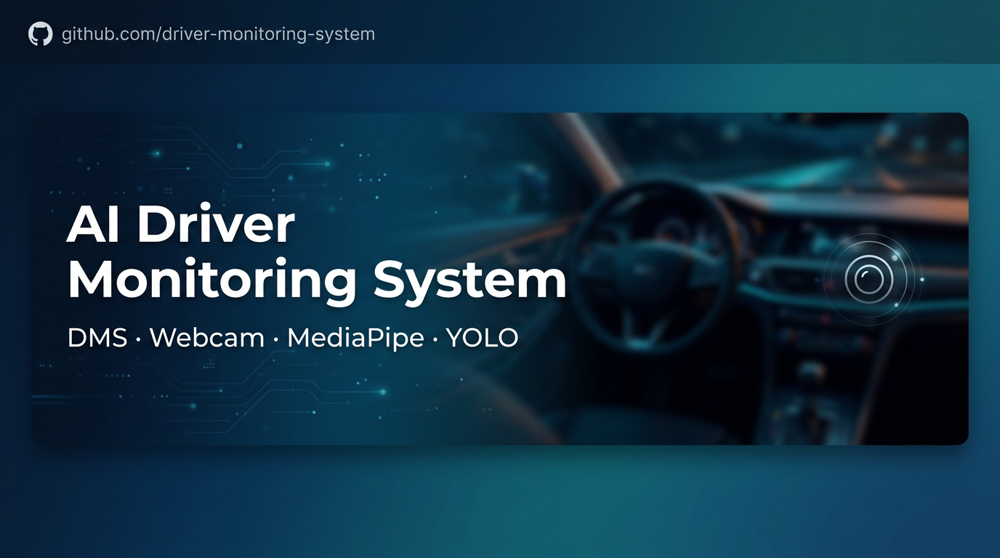

# AI Driver Monitoring System (DMS)  

**Webcam-based behavior monitoring (phone, smoking, hand activity, drowsiness) + driver identity verification + Telegram owner approval + driving session logs (fleet demo).**

[](https://www.python.org/)
[](https://flask.palletsprojects.com/)
[](https://react.dev/)
[](https://vitejs.dev/)

</div>

---

This README focuses on the **DMS part only**: backend `api.py` on port **8000**, frontend under `DiQuaMuaHaa/frontend/demothuattoanpro/`, and the ML training pipeline in `driver_training/`.

---

## Table of Contents

- [Overview](#overview)
- [Core Features](#core-features)
- [Architecture and Data Flow](#architecture-and-data-flow)
- [AI and ML Diagrams](#ai-and-ml-diagrams)
- [Tech Stack](#tech-stack)
- [Project Structure (DMS)](#project-structure-dms)
- [Requirements](#requirements)
- [Quick Start](#quick-start)
- [Environment Variables](#environment-variables)
- [HTTP API (DMS)](#http-api-dms)
- [Socket.IO (Real-time)](#socketio-real-time)
- [Driving Sessions and Alert Logs](#driving-sessions-and-alert-logs)
- [Frontend Routes (DMS)](#frontend-routes-dms)
- [Model Training](#model-training)
- [Assets Not Committed to Git](#assets-not-committed-to-git)
- [Security Notes](#security-notes)
- [Acknowledgments](#acknowledgments)

---

## Overview

The DMS is a full-stack system where the browser captures webcam frames, sends frames or landmarks to a Flask API, and returns real-time predictions. The backend uses **MediaPipe** for face/hand landmarks, **scikit-learn** pipelines for classification, and optional **Ultralytics YOLO** for phone detection through Socket.IO. **MySQL** stores identity profiles, Telegram owner bindings, and driving session logs.

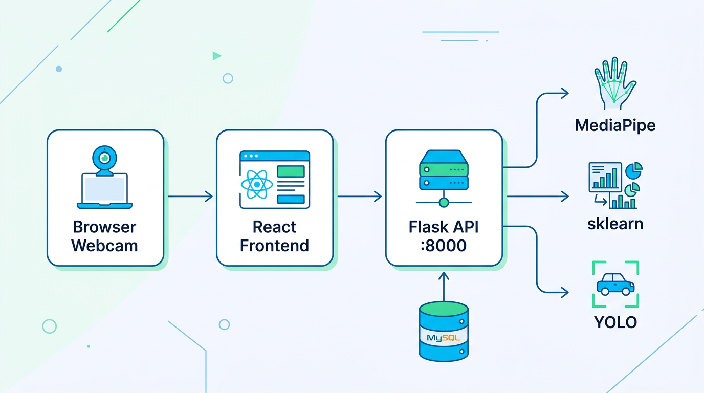

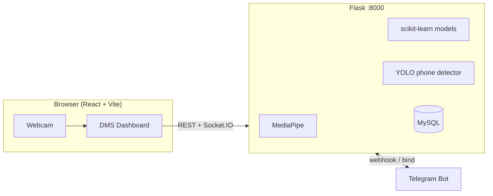

---

## Core Features

| Area | Description |
|------|-------------|
| **Face / expression state** | Landmark or base64 frame input, classified by `landmark_model.pkl`. |
| **Smoking detection** | Frame-based smoking classification (REST and Socket mode). |
| **Phone detection** | Landmark classifier and/or YOLO detection via `phone_frame` -> `phone_result`. |
| **Hand activity** | Hand landmark extraction + gesture/state classification. |
| **Driver identity** | Register/verify driver embeddings, owner binding, Telegram Accept/Reject decision flow. |
| **Driving sessions (fleet demo)** | Start/end session, increment per-alert counters (`phone`, `smoking`, `drowsy`, ...), query history by `driver_id`. |

---

## Architecture and Data Flow

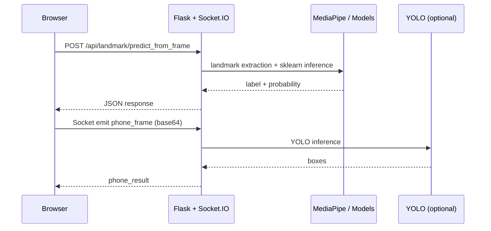

---

## AI and ML Diagrams

This section summarizes the actual AI components in your codebase (`driver_training/train/*.py` and runtime API).


### MLP pipeline illustration

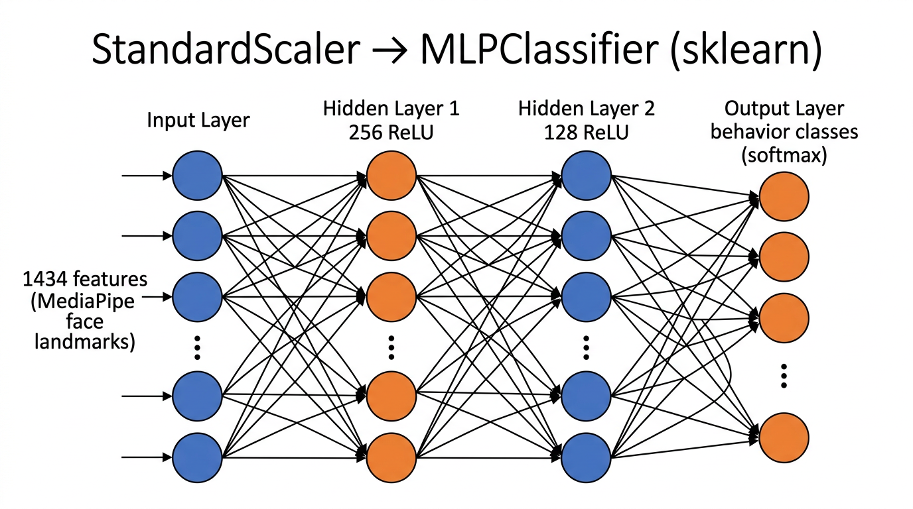

### MLP training design used in code

All major training scripts (`train_landmarks.py`, `train_smoking.py`, `train_phone.py`, `train_hands.py`) use:

- `Pipeline(StandardScaler -> MLPClassifier)`
- Representative config: `hidden_layer_sizes=(256, 128)`, `activation="relu"`, `solver="adam"`

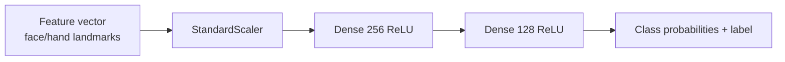

### Offline training to `.pkl`

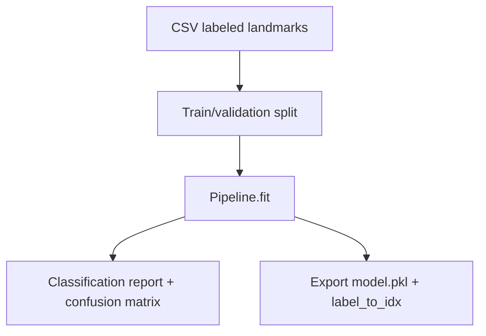

### Real-time inference (landmark branch)

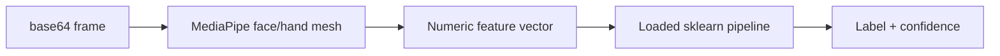

### YOLO phone branch

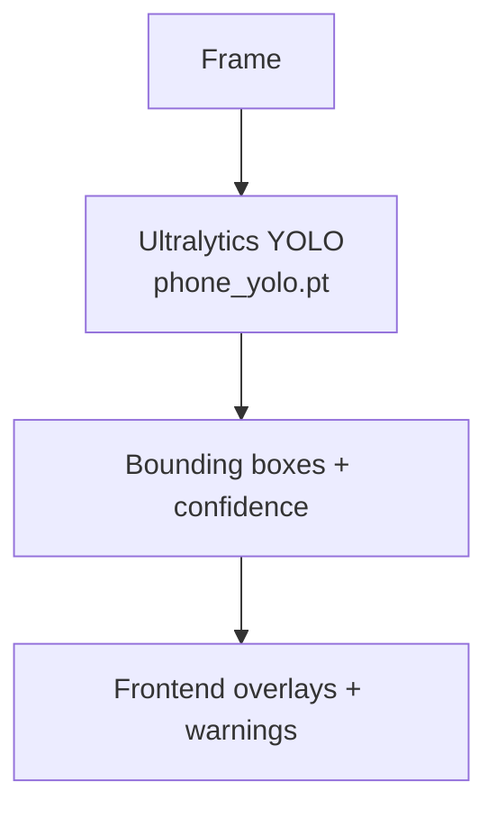

### Identity verification branch

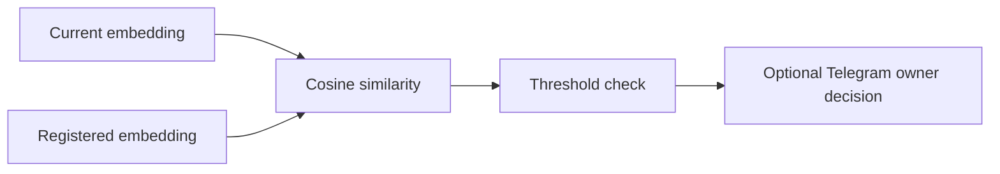

---

## Tech Stack

| Layer | Technologies |
|------|---------------|
| Frontend | React 19, Vite, React Router, Socket.IO client, Three.js |
| Backend DMS | Flask, Flask-CORS, PyMySQL, MediaPipe, OpenCV, NumPy, scikit-learn, joblib, Flask-SocketIO |
| ML / CV | scikit-learn (`.pkl`) and optional Ultralytics YOLO (`.pt`) |
| Database | MySQL (configured by `MYSQL_CONFIG` in `api.py`) |

---

## Project Structure (DMS)

```text
DiQuaMuaHaa/
├── backend/
│   ├── data/api/api.py              # DMS API + identity + Telegram + Socket.IO + sessions (:8000)
│   ├── requirements.txt
│   └── driver_training/
│       ├── collect/                 # data collection / conversion scripts
│       ├── train/                   # model training scripts
│       └── models/                  # .pkl and phone_yolo.pt (local assets)
└── frontend/demothuattoanpro/
    ├── src/
    │   ├── config/apiEndpoints.js
    │   ├── systeamdetectface/
    │   ├── testdata/thucmuctest.jsx # main DMS dashboard (/test3)
    │   ├── hand-dection/
    │   ├── utils/
    │   └── voice/
    └── vite.config.js

docs/
└── images/                          # README graphics
```

---

## Requirements

- Python **3.10+**
- Node.js **18+** and npm
- MySQL
- Webcam device for live testing

---

## Quick Start

### 1) Backend DMS (port 8000)

```bash
cd DiQuaMuaHaa/backend
python -m venv .venv
# Windows: .venv\Scripts\activate
# macOS/Linux: source .venv/bin/activate
pip install -r requirements.txt
pip install flask-socketio ultralytics
cd data/api
python api.py
```

### 2) Frontend

```bash
cd DiQuaMuaHaa/frontend/demothuattoanpro
npm install
npm run dev
```

Open the Vite URL (usually `http://localhost:5173`).

---

## Environment Variables

### Frontend (`demothuattoanpro/.env`)

| Variable | Purpose |
|----------|---------|
| `VITE_API_BASE` | DMS API base URL, e.g. `http://192.168.1.10:8000` or ngrok URL |

### Backend (system env for `api.py`)

| Variable | Purpose |
|----------|---------|
| `TELEGRAM_BOT_TOKEN` | Telegram bot token |
| `TELEGRAM_WEBHOOK_SECRET` | Secret token for webhook verification |
| `IDENTITY_SIM_THRESHOLD` | Face similarity threshold |
| `IDENTITY_MIN_REGISTER_SAMPLES` / `IDENTITY_MIN_VERIFY_SAMPLES` | Min samples for register/verify |
| `IDENTITY_DECISION_TIMEOUT_SEC` | Owner decision timeout |

MySQL connection parameters are controlled in `MYSQL_CONFIG` inside `api.py`.

---

## HTTP API (DMS)

| Method | Endpoint | Notes |
|--------|----------|-------|
| `GET` | `/health` | Health + model load state |
| `POST` | `/api/landmark/predict` | Predict from landmark vector |
| `POST` | `/api/landmark/predict_from_frame` | Predict from base64 frame |
| `POST` | `/api/smoking/predict_from_frame` | Smoking classifier |
| `POST` | `/api/phone/predict_from_frame` | Phone classifier (landmark branch) |
| `POST` | `/api/phone/detect_from_frame` | Phone detection variant |
| `POST` | `/api/hand/predict` | Hand landmarks |
| `POST` | `/api/hand/predict_from_frame` | Hand prediction from frame |
| `POST` | `/api/identity/register` | Register identity embedding |
| `POST` | `/api/identity/verify` | Verify identity |
| `GET` | `/api/identity/driver_profile` | Get registered profile |
| `POST` | `/api/identity/telegram/bind` | Bind Telegram owner to driver |
| `POST` | `/api/identity/request_decision` | Request owner decision |
| `GET` | `/api/identity/decision_status` | Poll decision by `request_id` |
| `POST` | `/api/telegram/webhook` | Telegram webhook handler |

---

## Socket.IO (Real-time)

| Emit | Receive | Payload |
|------|---------|---------|
| `phone_frame` | `phone_result` | `{ image: base64 } -> { boxes: [...] }` |
| `smoking_frame` | `smoking_result` | frame -> smoking label/probability |

---

## Driving Sessions and Alert Logs

For fleet/demo reporting, the frontend can open a session when driving is active and increment alert counters by type.

| Method | Endpoint | Notes |
|--------|----------|-------|
| `POST` | `/api/driving/session/start` | Optional `driver_id`, `label`; returns `session_id` |
| `POST` | `/api/driving/session/end` | Ends active session |
| `POST` | `/api/driving/session/alert` | Increment per-alert counter |
| `GET` | `/api/driving/sessions` | List recent sessions (`limit`, `driver_id`) |
| `GET` | `/api/driving/session/<id>` | Session details + alert counts |

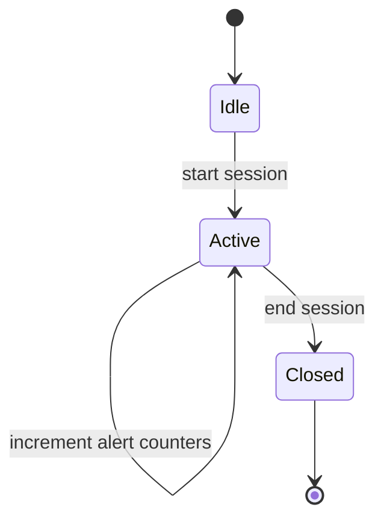

---

## Frontend Routes (DMS)

| Route | Purpose |
|------|---------|
| `/test3` | Extended DMS dashboard (REST + Socket + voice + session panel) |
| `/test4` | Hand detection screen |
| `/test5` | Face/identity-focused monitor screen |
| `/verifypro` | Verify flow testing |

---

## Model Training

1. Collect data with scripts in `backend/driver_training/collect/`.
2. Train with scripts in `backend/driver_training/train/`.
3. Place trained artifacts in `backend/driver_training/models/` with expected filenames (for example `landmark_model.pkl`, `phone_yolo.pt`).

---

## Assets Not Committed to Git

- `driver_training/models/` model weights (`.pkl`, `.pt`, ...)
- Large dataset directories
- Large generated CSVs and YOLO artifacts

---

## Security Notes

- Do not commit Telegram tokens, webhook secrets, or DB credentials.
- Use environment variables for production secrets.
- Restrict CORS and secure webhook endpoints in deployment.
- Use non-default MySQL credentials with limited privileges.

---

## Acknowledgments

Built with **MediaPipe**, **OpenCV**, **scikit-learn**, and optional **Ultralytics YOLO**. Identity decision flow integrates **Telegram Bot API** and **MySQL**.

---

<div align="center">

Made with focus on **driver safety** and **transparent operational logging**.

</div>
