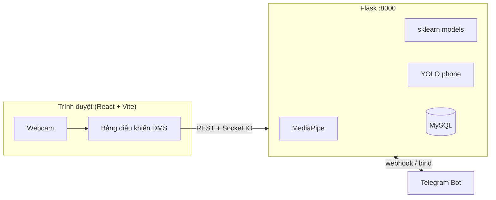
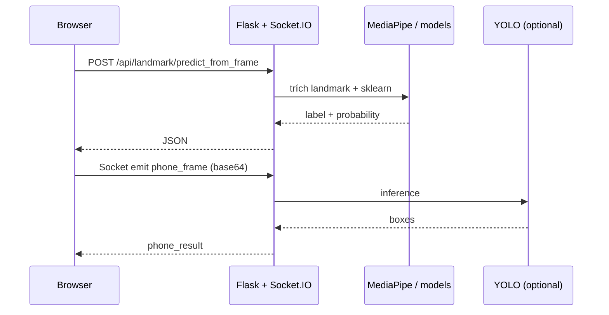
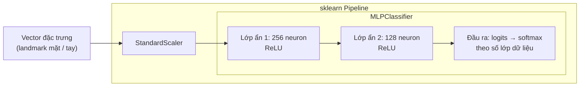
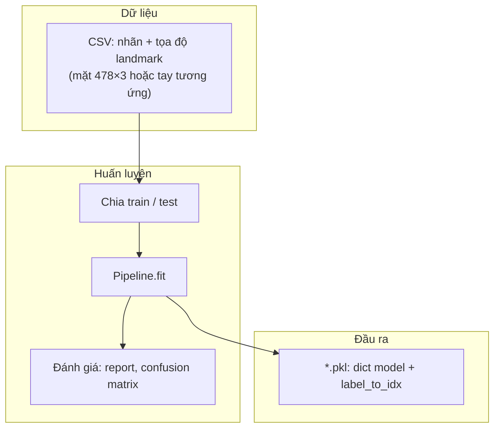
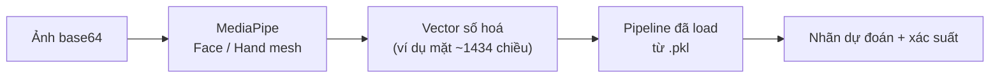
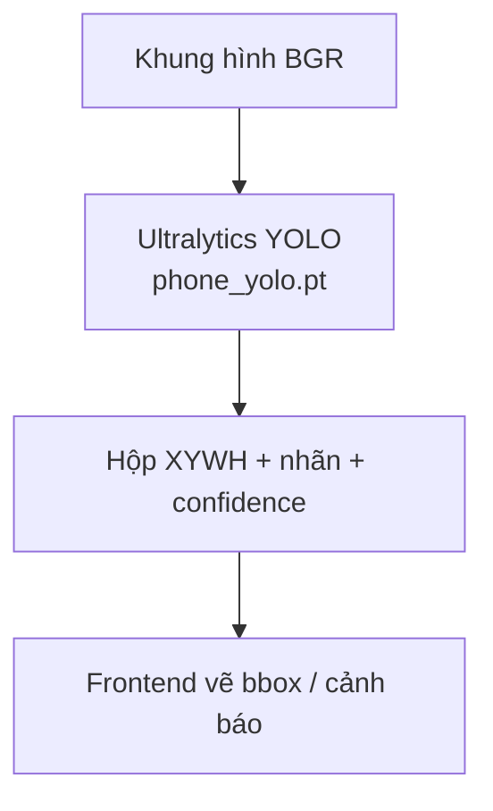
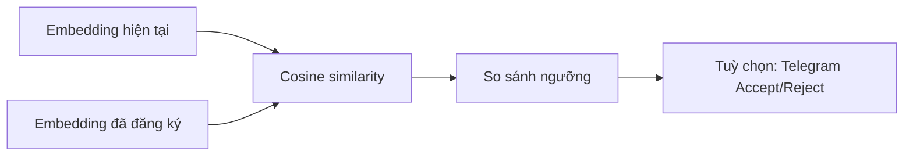
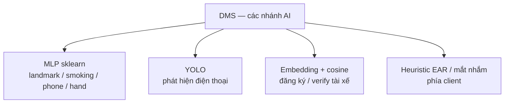
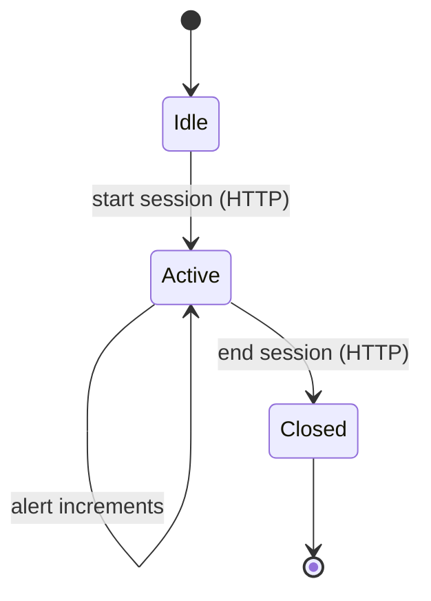

<div align="center">


# Hệ thống giám sát tài xế AI (DMS)

**Webcam → nhận diện hành vi (điện thoại, hút thuốc, tay, mệt mỏi…) · xác thực danh tính · phê duyệt chủ xe qua Telegram · nhật ký phiên lái (fleet demo)**

[](https://www.python.org/)
[](https://flask.palletsprojects.com/)
[](https://react.dev/)
[](https://vitejs.dev/)

</div>

---

Tài liệu này **chỉ mô tả phần DMS** (Driver Monitoring System): backend `api.py` cổng **8000**, frontend trong `DiQuaMuaHaa/frontend/demothuattoanpro/`, và pipeline huấn luyện `driver_training/`. Các màn hình/demo khác trong repo (nếu có) không được trình bày ở đây.

---

## Mục lục

- [Tổng quan](#tổng-quan)
- [Tính năng](#tính-năng)
- [Kiến trúc & luồng dữ liệu](#kiến-trúc--luồng-dữ-liệu)
- [Sơ đồ AI và học máy (đồ án)](#ai-thesis-diagrams)
- [Công nghệ](#công-nghệ)
- [Cấu trúc thư mục (DMS)](#cấu-trúc-thư-mục-dms)
- [Yêu cầu hệ thống](#yêu-cầu-hệ-thống)
- [Cài đặt nhanh](#cài-đặt-nhanh)
- [Biến môi trường](#biến-môi-trường)
- [HTTP API (DMS)](#http-api-dms)
- [Socket.IO (thời gian thực)](#socketio-thời-gian-thực)
- [Phiên lái & nhật ký cảnh báo](#phiên-lái--nhật-ký-cảnh-báo)
- [Giao diện web (route DMS)](#giao-diện-web-route-dms)
- [Huấn luyện model](#huấn-luyện-model)
- [Tài nguyên không đưa lên Git](#tài-nguyên-không-đưa-lên-git)
- [Bảo mật](#bảo-mật)
- [Ghi nhận](#ghi-nhận)

---

## Tổng quan

DMS là ứng dụng full-stack: trình duyệt lấy **video webcam**, gửi khung hình hoặc landmark lên **Flask API** để suy luận hành vi; **MediaPipe** xử lý khuôn mặt/tay trên server; **scikit-learn** phân loại hành vi từ vector đặc trưng; **Ultralytics YOLO** (tùy chọn) phát hiện điện thoại qua **Socket.IO** độ trễ thấp. **MySQL** lưu embedding khuôn mặt, cấu hình Telegram, và **phiên lái** (thời gian bắt đầu/kết thúc, số lần cảnh báo theo loại).




---

## Tính năng

| Nhóm | Mô tả |
|------|--------|
| **Khuôn mặt / biểu cảm** | Gửi landmark hoặc ảnh base64 → dự đoán nhãn qua model landmark (`landmark_model.pkl`). |
| **Hút thuốc** | Phân loại từ khung hình (REST hoặc Socket `smoking_frame`). |
| **Điện thoại** | Model landmark và/hoặc phát hiện YOLO qua Socket `phone_frame` → `phone_result`. |
| **Tay** | Hand landmarks → phân loại cử chỉ/tư thế tay. |
| **Danh tính tài xế** | Đăng ký / xác minh embedding; liên kết chủ xe Telegram; luồng Accept/Reject khi nghi ngờ không đúng chủ. |
| **Phiên lái (fleet demo)** | Bắt đầu/kết thúc phiên; tăng bộ đếm cảnh báo theo loại (`phone`, `smoking`, `drowsy`, …); xem lịch sử theo `driver_id`. |

---

## Kiến trúc & luồng dữ liệu



<a id="ai-thesis-diagrams"></a>

## Sơ đồ AI và học máy (đồ án)

Phần này tóm tắt **mô hình trong code** (`driver_training/train/*.py`): các nhánh landmark dùng **Perceptron đa lớp (MLP)** trong scikit-learn; nhánh điện thoại (real-time) có thể dùng **YOLO**; xác thực danh tính dùng **vector embedding** + độ tương đồng.

### Ảnh minh họa MLP (Pipeline sklearn)


### Kiến trúc MLP theo code huấn luyện

Các script `train_landmarks.py`, `train_smoking.py`, `train_phone.py`, `train_hands.py` đều build **`Pipeline(StandardScaler → MLPClassifier)`** với cấu hình đại diện:

| Thành phần | Tham số (trích từ code) |
|------------|-------------------------|
| **Chuẩn hoá** | `StandardScaler` (zero mean, unit variance theo đặc trưng) |
| **MLP** | `hidden_layer_sizes=(256, 128)`, `activation="relu"`, `solver="adam"` |
| **Đầu ra** | Phân loại đa lớp (softmax / log-loss) → nhãn hành vi / tay / điện thoại (landmark) / … |



### Luồng học (offline) → file `.pkl`



### Luồng suy luận thời gian thực (landmark + MLP)



### Nhánh phát hiện điện thoại bằng YOLO (khác MLP)

YOLO là **mô hình tích chập / một pha detector**, không dùng vector landmark; phù hợp **Socket.IO** gửi khung hình liên tục.



### Xác thực danh tính (embedding + độ tương đồng)

Không phải MLP phân lớp: hệ thống so sánh **vector embedding** khuôn mặt (normalize) với embedding đã lưu MySQL; ngưỡng `IDENTITY_SIM_THRESHOLD`.



### Tổng hợp các nhánh AI trong DMS



---

## Công nghệ

| Lớp | Công nghệ |
|-----|-----------|
| Frontend | React 19, Vite, React Router, Socket.IO client, Three.js (một số màn), Tailwind (nếu dùng trong dự án) |
| Backend DMS | Flask, Flask-CORS, PyMySQL, MediaPipe, OpenCV, NumPy, scikit-learn, joblib, Flask-SocketIO |
| ML / CV | scikit-learn (`.pkl`), Ultralytics YOLO (`.pt`) — tùy cấu hình |
| CSDL | MySQL (ví dụ XAMPP), database cấu hình trong `MYSQL_CONFIG` của `api.py` |

---

## Cấu trúc thư mục (DMS)

```
DiQuaMuaHaa/
├── backend/
│   ├── data/api/api.py          # API DMS + identity + Telegram + Socket.IO + phiên lái (:8000)
│   ├── requirements.txt
│   └── driver_training/         # Thu thập dữ liệu & huấn luyện
│       ├── collect/
│       ├── train/
│       └── models/              # .pkl, phone_yolo.pt — không commit (xem bên dưới)
└── frontend/demothuattoanpro/   # React (Vite)
    ├── src/
    │   ├── config/apiEndpoints.js   # VITE_API_BASE, VITE_MEDICAL_API_BASE (DMS dùng base cổng 8000)
    │   ├── systeamdetectface/       # Face mesh, OwnerVerifyGate, …
    │   ├── testdata/thucmuctest.jsx # Dashboard DMS chính (/test3)
    │   ├── hand-dection/            # Tay (/test4)
    │   ├── utils/                   # drivingSessionApi, camera, speech, …
    │   └── voice/                   # Trợ lý giọng (tích hợp dashboard)
    └── vite.config.js
docs/
└── images/                      # Banner, kiến trúc, sơ đồ MLP (đồ án)
```

---

## Yêu cầu hệ thống

- **Python 3.10+**
- **Node.js 18+** và npm
- **MySQL** (tạo database trùng cấu hình trong `api.py`)
- **Webcam** cho demo thời gian thực

---

## Cài đặt nhanh

### 1. Backend DMS (cổng 8000)

```bash
cd DiQuaMuaHaa/backend
python -m venv .venv
# Windows: .venv\Scripts\activate
# macOS/Linux: source .venv/bin/activate
pip install -r requirements.txt
pip install flask-socketio ultralytics
cd data/api
python api.py
```

Mặc định lắng nghe **`http://0.0.0.0:8000`** (xem `if __name__ == "__main__"` trong `api.py`).

### 2. Frontend

```bash
cd DiQuaMuaHaa/frontend/demothuattoanpro
npm install
npm run dev
```

Mở URL Vite in ra (thường **`http://localhost:5173`**).

### 3. (Tùy chọn) Tunnel / LAN

Đặt `VITE_API_BASE` trỏ tới máy chạy Flask (hoặc ngrok) để điện thoại trong cùng mạng gọi được API — xem `src/config/apiEndpoints.js`.

---

## Biến môi trường

### Frontend (`.env` trong `demothuattoanpro/`)

| Biến | Ý nghĩa |
|------|---------|
| `VITE_API_BASE` | URL gốc API DMS (ví dụ `http://192.168.1.10:8000` hoặc URL ngrok), **không** dấu `/` cuối |

### Backend (`api.py` / môi trường hệ thống)

| Biến | Ý nghĩa |
|------|---------|
| `TELEGRAM_BOT_TOKEN` | Token bot Telegram |
| `TELEGRAM_WEBHOOK_SECRET` | Chuỗi bí mật xác thực webhook (nên dùng chuỗi ngẫu nhiên) |
| `IDENTITY_SIM_THRESHOLD` | Ngưỡng độ tương đồng khuôn mặt |
| `IDENTITY_MIN_REGISTER_SAMPLES` / `IDENTITY_MIN_VERIFY_SAMPLES` | Số mẫu tối thiểu đăng ký / xác minh |
| `IDENTITY_DECISION_TIMEOUT_SEC` | Thời gian chờ chủ xe phản hồi |

Kết nối MySQL chỉnh trong **`MYSQL_CONFIG`** (host, user, password, database) trong `api.py`.

---

## HTTP API (DMS)

| Phương thức | Đường dẫn | Ghi chú |
|-------------|-----------|---------|
| `GET` | `/health` | Trạng thái server & model đã load |
| `POST` | `/api/landmark/predict` | JSON `landmarks` (vector) |
| `POST` | `/api/landmark/predict_from_frame` | JSON `image` (base64) |
| `POST` | `/api/smoking/predict_from_frame` | Ảnh base64 → hút thuốc / không |
| `POST` | `/api/phone/predict_from_frame` | Ảnh base64 (model landmark) |
| `POST` | `/api/phone/detect_from_frame` | Biến thể phát hiện điện thoại |
| `POST` | `/api/hand/predict` | Landmarks tay |
| `POST` | `/api/hand/predict_from_frame` | Ảnh base64 → tay |
| `POST` | `/api/identity/register` | Đăng ký embedding tài xế |
| `POST` | `/api/identity/verify` | Xác minh tài xế |
| `GET` | `/api/identity/driver_profile` | Hồ sơ đã đăng ký |
| `POST` | `/api/identity/telegram/bind` | Bind Telegram ↔ `driver_id` |
| `POST` | `/api/identity/request_decision` | Gửi yêu cầu quyết định chủ xe |
| `GET` | `/api/identity/decision_status` | Poll trạng thái (query `request_id`) |
| `POST` | `/api/telegram/webhook` | Webhook Telegram (callback Accept/Reject, `/bind`, …) |

---

## Socket.IO (thời gian thực)

| Sự kiện gửi | Sự kiện nhận | Nội dung (tóm tắt) |
|-------------|--------------|---------------------|
| `phone_frame` | `phone_result` | `{ image: base64 }` → `{ boxes: [...] }` (cần `phone_yolo.pt`) |
| `smoking_frame` | `smoking_result` | Ảnh → nhãn / xác suất hút thuốc |

Kết nối Socket.IO tới cùng host/cổng với Flask (mặc định `:8000`).

---

## Phiên lái & nhật ký cảnh báo

Phục vụ demo **fleet / báo cáo**: mỗi lần tài xế vào trạng thái giám sát **active**, client có thể mở phiên; mỗi lần cảnh báo theo loại (ví dụ điện thoại, hút thuốc, buồn ngủ) được ghi nhận.

| Phương thức | Đường dẫn | Ghi chú |
|-------------|-----------|---------|
| `POST` | `/api/driving/session/start` | Body: `driver_id`, `label` (tuỳ chọn) → `session_id`, `started_at` |
| `POST` | `/api/driving/session/end` | Body: `session_id` → đặt `ended_at` |
| `POST` | `/api/driving/session/alert` | Body: `session_id`, `alert_type`, `delta` (mặc định 1) |
| `GET` | `/api/driving/sessions` | Query: `limit`, `driver_id` (tuỳ chọn) |
| `GET` | `/api/driving/session/<id>` | Chi tiết một phiên + map `alert_type` → `count` |

Các giá trị `alert_type` hợp lệ được định nghĩa trong code (`DRIVING_ALERT_TYPES` trong `api.py`), ví dụ: `phone`, `smoking`, `drowsy`, …



---

## Giao diện web (route DMS)

Các route dưới đây dùng API DMS (**8000**) qua `getDmsApiBase()` / `VITE_API_BASE`:

| Đường dẫn | Mô tả |
|-----------|--------|
| `/test3` | Dashboard giám sát mở rộng (REST + Socket, phiên lái, giọng nói, …) |
| `/test4` | Nhận diện tay |
| `/test5` | Giao diện face / giám sát (Face Mesh, xác thực, …) |
| `/verifypro` | Luồng verify / thử nghiệm xác minh |

---

## Huấn luyện model

1. Dùng script trong `DiQuaMuaHaa/backend/driver_training/collect/` để thu thập dữ liệu và CSV.
2. Huấn luyện bằng `driver_training/train/*.py` (landmark, smoking, phone, hands, …).
3. Sao chép file model vào `driver_training/models/` đúng tên mà `api.py` mong đợi (ví dụ `landmark_model.pkl`, `phone_yolo.pt`).

Tham khảo thêm: `DiQuaMuaHaa/ROADMAP_DRIVER_BEHAVIOR.md`, `TRAIN_VS_PRETRAINED.md` (nếu có trong repo).

---

## Tài nguyên không đưa lên Git

- Thư mục **`driver_training/models/`** (`.pkl`, `.pt`, …)
- Dataset lớn, file CSV vượt giới hạn GitHub
- File trọng số YOLO tải riêng

---

## Bảo mật

- **Không** commit token Telegram, webhook secret, hoặc mật khẩu database.
- Dùng biến môi trường cho production; siết **CORS** và URL **Telegram webhook** khi deploy công khai.
- Đổi mật khẩu MySQL mặc định và hạn chế quyền user DB.

---

## Ghi nhận

Dự án DMS sử dụng **MediaPipe**, **OpenCV**, **scikit-learn**, và tùy chọn **Ultralytics YOLO**. Luồng danh tính tích hợp **Telegram Bot API** và **MySQL**.

---

<div align="center">

**Nếu ảnh banner/sơ đồ hiển thị lỗi trên GitHub**, kiểm tra đường dẫn tương đối `docs/images/` đã được push cùng commit.

Made with focus on **driver safety** and **transparent logging**.

</div>
