# BÁO CÁO ĐỒ ÁN CƠ SỞ - AI DRIVER MONITORING SYSTEM (DMS)

---

## CHƯƠNG 1 - GIỚI THIỆU ĐỀ TÀI

### 1.1 Đặt vấn đề

Trong bối cảnh giao thông hiện đại, tai nạn giao thông đường bộ là một trong những nguyên nhân hàng đầu gây tử vong và thương tích nghiêm trọng tại Việt Nam cũng như trên toàn thế giới. Theo thống kê của Tổ chức Y tế Thế giới (WHO), hàng năm có khoảng 1,3 triệu người tử vong do tai nạn giao thông và hàng chục triệu người bị thương tật. Trong số các nguyên nhân chính dẫn đến tai nạn, hành vi lái xe mất tập trung chiếm tỷ lệ đáng kể.

Các hành vi nguy hiểm phổ biến bao gồm:
- **Sử dụng điện thoại** trong khi lái xe: làm giảm khả năng quan sát và phản ứng của tài xế
- **Buồn ngủ, mệt mỏi**: gây giảm tập trung, phản xạ chậm, thậm chí ngủ gật
- **Hút thuốc lá**: gây mất tập trung và giảm khả năng điều khiển xe
- **Các cử chỉ tay không liên quan đến việc lái xe**: làm phân tâm người điều khiển

Các nghiên cứu cho thấy việc phát hiện sớm và cảnh báo kịp thời các hành vi nguy hiểm này có thể giảm đáng kể nguy cơ tai nạn. Tuy nhiên, hệ thống giám sát truyền thống thường phụ thuộc vào camera giám sát sau sự kiện hoặc cảnh sát giao thông, không đủ để can thiệp ngay lập tức.

### 1.2 Mục tiêu đề tài

Đề tài **"AI Driver Monitoring System (DMS)"** được xây dựng nhằm mục đích phát triển một hệ thống giám sát tài xế thông minh dựa trên trí tuệ nhân tạo, có khả năng:

1. **Giám sát real-time**: Phân tích video từ webcam theo thời gian thực để phát hiện hành vi nguy hiểm
2. **Xác thực danh tính tài xế**: Sử dụng nhận diện khuôn mặt để xác minh người điều khiển xe có phải là chủ xe/tài xế được ủy quyền hay không
3. **Cảnh báo hành vi nguy hiểm**: Phát hiện và cảnh báo khi phát hiện sử dụng điện thoại, hút thuốc, buồn ngủ, hoặc cử chỉ tay bất thường
4. **Thông báo qua Telegram**: Tích hợp Telegram Bot để chủ xe nhận thông báo và phê duyệt/xác nhận tài xế khi phát hiện người lạ
5. **Ghi log phiên lái xe**: Lưu trữ lịch sử các phiên lái xe và thống kê cảnh báo để phục vụ quản lý đội xe

### 1.3 Phạm vi hệ thống

#### 1.3.1 Phạm vi giám sát

Hệ thống giám sát thông qua **webcam** được đặt trong khoang lái, hướng về phía tài xế. Dữ liệu video được xử lý theo thời gian thực thông qua các thuật toán AI/ML.

#### 1.3.2 Các hành vi được phát hiện

| STT | Hành vi | Phương pháp phát hiện |
|-----|---------|----------------------|
| 1 | **Sử dụng điện thoại** | YOLO object detection + Landmark classification |
| 2 | **Hút thuốc lá** | Face landmark classification (MediaPipe + scikit-learn) |
| 3 | **Buồn ngủ/Drowsiness** | EAR (Eye Aspect Ratio) analysis + Face landmark |
| 4 | **Cử chỉ tay** | Hand landmark classification (MediaPipe Hands) |

#### 1.3.3 Tích hợp Telegram Bot

Hệ thống tích hợp Telegram Bot để:
- Gửi thông báo cảnh báo đến chủ xe khi phát hiện hành vi nguy hiểm
- Cho phép chủ xe phê duyệt hoặc từ chối tài xế không phải chính chủ qua tin nhắn tương tác
- Lệnh `/bind` để liên kết tài khoản Telegram với xe
- Lệnh `/start` để bắt đầu sử dụng bot

---

## CHƯƠNG 2 - QUY TRÌNH HOẠT ĐỘNG

### 2.1 Quy trình 1 - Đăng nhập và xác thực danh tính tài xế

Quy trình này đảm bảo chỉ tài xế được ủy quyền mới có thể điều khiển xe, kết hợp giữa xác thực khuôn mặt và phê duyệt từ chủ xe qua Telegram.

**Bước 1: [Người dùng] Truy cập giao diện đăng nhập**
- Người dùng mở ứng dụng web tại địa chỉ frontend (thường `http://localhost:5173`)
- Hệ thống hiển thị trang đăng nhập/đăng ký với form nhập email, mật khẩu, và thông tin cá nhân

**Bước 2: [Người dùng] Đăng nhập hệ thống**
- Người dùng nhập email và mật khẩu đã đăng ký
- [Hệ thống] Frontend gửi request POST `/api/auth/login` đến backend với payload `{email, password}`
- [Hệ thống] Backend xác thực thông tin và trả về JWT token + thông tin user

**Bước 3: [Người dùng] Kích hoạt camera để đăng ký/xác thực khuôn mặt**
- Người dùng cho phép truy cập webcam
- [Hệ thống] Frontend khởi động MediaPipe Face Mesh để phát hiện khuôn mặt theo thời gian thực

**Bước 4: [AI Model] Trích xuất face embeddings**
- [AI Model] MediaPipe Face Mesh trích xuất 468 landmarks từ khuôn mặt tài xế
- [Hệ thống] Các embeddings được thu thập qua nhiều frame (mặc định >= 3 frame) để đảm bảo độ chính xác

**Bước 5: [Hệ thống] Đăng ký danh tính (cho chủ xe lần đầu)**
- Nếu chưa có danh tính đăng ký, [Hệ thống] gửi POST `/api/auth/register` với `{driver_id, name, image_base64}`
- [Hệ thống] Backend tính trung bình embeddings và lưu vào bảng `driver_identity` (MySQL)
- [Hệ thống] Trả về xác nhận đăng ký thành công

**Bước 6: [Hệ thống] Xác thực danh tính real-time**
- [Hệ thống] Frontend gửi POST `/api/auth/verify` với frame webcam hiện tại
- [AI Model] Backend trích embedding hiện tại và so sánh với embedding đã đăng ký bằng Cosine Similarity
- [Hệ thống] Tính toán độ tương đồng (similarity), so với ngưỡng (threshold, mặc định 0.60)

**Bước 7: [Hệ thống] Phân loại kết quả xác thực**
- Nếu `similarity >= threshold`: [Hệ thống] xác định là **chính chủ** (is_owner = true), cho phép điều khiển xe
- Nếu `similarity < threshold`: [Hệ thống] xác định là **người lạ** (is_owner = false), chuyển sang quy trình phê duyệt

**Bước 8: [Hệ thống] Gửi yêu cầu phê duyệt qua Telegram (khi là người lạ)**
- [Hệ thống] Gửi POST `/api/auth/request_decision` với `phase=auth`
- [Hệ thống] Backend tạo request trong bảng `identity_decision_requests` với status='pending'
- [Telegram Bot] Gửi tin nhắn đến chủ xe kèm ảnh snapshot và 2 nút: "Accept" / "Reject"
- [Hệ thống] Trả về `request_id` và thời gian chờ (mặc định 120 giây)

**Bước 9: [Chủ xe - Telegram] Quyết định phê duyệt**
- [Chủ xe] Nhận thông báo trên Telegram với thông tin tài xế lạ
- [Chủ xe] Chọn "Accept" để cho phép tài xế điều khiển, hoặc "Reject" để từ chối
- [Telegram Bot] Gửi callback dạng `idr:accept:<request_id>` hoặc `idr:reject:<request_id>`

**Bước 10: [Hệ thống] Cập nhật quyết định và cho phép/từ chối truy cập**
- [Hệ thống] Webhook `/api/telegram/webhook` nhận callback và cập nhật bảng `identity_decision_requests`
- Nếu **Accept**: [Hệ thống] cập nhật status='accepted', [Người dùng] được chuyển sang trang điều khiển
- Nếu **Reject**: [Hệ thống] cập nhật status='rejected', hiển thị màn hình khóa với thông báo "Owner Rejected"
- Nếu **hết thời gian**: [Hệ thống] tự động cập nhật status='expired'

**Bước 11: [Hệ thống] Liên kết Telegram với xe (setup một lần)**
- [Chủ xe] Gửi lệnh `/bind <driver_id>` trong Telegram Bot
- [Telegram Bot] Gọi webhook lưu `telegram_chat_id` và `telegram_user_id` vào bảng `driver_telegram_owner`
- [Hệ thống] Xác nhận liên kết thành công, từ nay chủ xe sẽ nhận được thông báo từ xe

---

### 2.2 Quy trình 2 - Giám sát hành vi nguy hiểm real-time

Quy trình này chạy liên tục trong suốt phiên lái xe để phát hiện và cảnh báo các hành vi nguy hiểm.

**Bước 1: [Người dùng] Bắt đầu phiên giám sát**
- Sau khi xác thực thành công, [Người dùng] nhấn nút "Bắt đầu" trên Dashboard
- [Hệ thống] Frontend khởi động WebSocket connection đến backend (Socket.IO)
- [Hệ thống] Thiết lập các interval cho face, hand, smoking, phone detection

**Bước 2: [Hệ thống] Capture frame từ webcam**
- [Hệ thống] Canvas lấy frame từ video element mỗi 1000ms (face) và 150ms (hand)
- [Hệ thống] Chuyển đổi frame thành base64 image để gửi đến backend

**Bước 3: [AI Model] Phát hiện buồn ngủ (Drowsiness Detection)**
- [AI Model] MediaPipe Face Mesh trích xuất landmarks khuôn mặt (468 points)
- [Hệ thống] POST `/api/monitor/face` gửi base64 frame đến backend
- [AI Model] Model MLPClassifier (landmark_model.pkl) dự đoán label: 'safe', 'drowsy', 'no_face'
- [Hệ thống] Tính EAR (Eye Aspect Ratio) từ landmarks mắt để phát hiện mắt nhắm lâu

**Bước 4: [Hệ thống] Cảnh báo buồn ngủ**
- Nếu [AI Model] phát hiện `label == 'drowsy'` và `prob >= 0.52`: [Hệ thống] kích hoạt cảnh báo
- [Hệ thống] Phát âm thanh cảnh báo (alarm sound), hiển thị overlay cảnh báo màu đỏ
- [Hệ thống] Tăng bộ đếm cảnh báo trong phiên lái xe (nếu session đang active)

**Bước 5: [AI Model] Phát hiện sử dụng điện thoại (Phone Detection)**
- **Phương pháp 1 - WebSocket YOLO**: [Hệ thống] emit event `phone_frame` qua Socket.IO
- [AI Model] Backend chạy YOLOv8 (phone_yolo.pt) để detect object "phone" trong frame
- [AI Model] Trả về bounding boxes với confidence score
- **Phương pháp 2 - REST API**: [Hệ thống] POST `/api/monitor/phone/detect` hoặc `/api/monitor/phone`
- [AI Model] Dùng landmark model hoặc image classification để xác định

**Bước 6: [Hệ thống] Cảnh báo sử dụng điện thoại**
- Nếu [AI Model] phát hiện điện thoại (`boxes.length > 0` hoặc `label == 'phone'`): [Hệ thống] kích hoạt cảnh báo
- [Hệ thống] Hiển thị overlay "Phone Detected" với bounding box trên video
- [Hệ thống] Phát âm thanh cảnh báo nếu phát hiện liên tục > 3 giây
- [Hệ thống] Ghi nhận số lần cảnh báo phone vào session log

**Bước 7: [AI Model] Phát hiện hút thuốc (Smoking Detection)**
- [Hệ thống] WebSocket emit event `smoking_frame` hoặc POST `/api/monitor/smoking`
- [AI Model] MediaPipe trích landmarks, model smoking_model.pkl dự đoán
- [AI Model] Trả về label: 'smoking' hoặc 'no_smoking' với confidence threshold 0.90

**Bước 8: [Hệ thống] Cảnh báo hút thuốc**
- Nếu [AI Model] phát hiện `label == 'smoking'` và `prob >= 0.90`: [Hệ thống] kích hoạt cảnh báo
- [Hệ thống] Hiển thị overlay "Smoking Detected" màu đỏ
- [Hệ thống] Phát âm thanh cảnh báo và tăng counter trong session

**Bước 9: [AI Model] Phát hiện cử chỉ tay (Hand Gesture Detection)**
- [Hệ thống] MediaPipe Hands trích xuất 21 landmarks (63 giá trị normalized) từ bàn tay
- [Hệ thống] POST `/api/monitor/hand` hoặc `/api/monitor/hand/predict` với landmarks
- [AI Model] Model hand_model.pkl phân loại các ký hiệu tay: 'thumbs_up', 'open_palm', 'fist', v.v.
- [Hệ thống] Độ tin cậy cần >= 0.75 để trigger action

**Bước 10: [Hệ thống] Thực thi lệnh từ cử chỉ tay**
- [Hệ thống] Nhận diện ký hiệu tay và mapping đến action tương ứng
- Ví dụ: 'open_palm' -> mở menu nhanh, 'thumbs_up' -> xác nhận lệnh
- [Hệ thống] Thực thi action trên giao diện (mở/tắt đèn cabin, điều hòa, mở YouTube)

**Bước 11: [Hệ thống] Continuous monitoring và lọc nhiễu**
- [Hệ thống] Áp dụng kỹ thuật **hysteresis** (history buffer) để tránh false-positive
- [Hệ thống] Cần ít nhất 2-3 frame liên tiếp cùng label mới trigger cảnh báo
- [Hệ thống] Cập nhật UI real-time với các chỉ số: số lần cảnh báo, thời gian lái, trạng thái tài xế

**Bước 12: [Hệ thống] Tích hợp Voice Assistant (optional)**
- [Hệ thống] "Hey Car" wake word detection để kích hoạt trợ lý giọng nói
- [Người dùng] Ra lệnh bằng giọng nói: "Bật đèn", "Mở điều hòa", "Mở YouTube"
- [Hệ thống] Thực thi lệnh và phản hồi bằng giọng nói tổng hợp

---

### 2.3 Quy trình 3 - Quản lý phiên lái xe và xem lịch sử cảnh báo

Quy trình này quản lý vòng đời của phiên lái xe và cung cấp báo cáo thống kê cho quản lý đội xe.

**Bước 1: [Người dùng] Bắt đầu phiên lái xe**
- Sau khi xác thực thành công, [Người dùng] nhấn nút "Bắt đầu phiên lái" trên Dashboard
- [Hệ thống] Frontend gửi POST `/api/session/start` với `{driver_id, label}`
- [Hệ thống] Backend tạo record trong bảng `driving_sessions` với `started_at` = thời gian hiện tại, `ended_at` = NULL
- [Hệ thống] Trả về `session_id` để frontend theo dõi

**Bước 2: [Hệ thống] Theo dõi phiên lái xe active**
- [Hệ thống] Lưu `session_id` vào state của ứng dụng
- [Hệ thống] Mọi cảnh báo phát sinh trong phiên sẽ được ghi nhận vào session này
- [Hệ thống] Dashboard hiển thị thông tin: thời gian bắt đầu, tài xế, số cảnh báo hiện tại

**Bước 3: [Hệ thống] Ghi nhận cảnh báo trong phiên**
- Khi [AI Model] phát hiện hành vi nguy hiểm (phone, smoking, drowsy):
- [Hệ thống] Frontend gửi POST `/api/session/alert` với `{session_id, alert_type, delta}`
- [Hệ thống] Backend tìm hoặc tạo record trong `driving_session_alerts` với `(session_id, alert_type)`
- [Hệ thống] Tăng counter `count` lên `delta` (mặc định 1) cho loại cảnh báo tương ứng
- [Hệ thống] Các loại cảnh báo hỗ trợ: 'phone', 'smoking', 'drowsy', 'seatbelt', 'generic'

**Bước 4: [Hệ thống] Cập nhật real-time trên Dashboard**
- [Hệ thống] Hook `useDrivingSession` theo dõi các alert counts
- [Hệ thống] UI hiển thị bộ đếm: số lần cảnh báo điện thoại, hút thuốc, buồn ngủ
- [Hệ thống] Cập nhật liên tục khi có cảnh báo mới

**Bước 5: [Người dùng] Kết thúc phiên lái xe**
- Khi tài xế dừng xe và tắt hệ thống, [Người dùng] nhấn nút "Kết thúc phiên"
- [Hệ thống] Frontend gửi POST `/api/session/end` với `{session_id}`
- [Hệ thống] Backend cập nhật `ended_at` = thời gian hiện tại trong bảng `driving_sessions`
- [Hệ thống] Phiên lái chuyển sang trạng thái "Closed", không thể thêm cảnh báo mới

**Bước 6: [Người dùng/Hệ thống] Xem danh sách phiên lái**
- [Người dùng] Truy cập mục "Lịch sử phiên lái" trên Dashboard
- [Hệ thống] Gửi GET `/api/session/list?limit=30&driver_id=xxx` (có thể lọc theo tài xế)
- [Hệ thống] Backend truy vấn bảng `driving_sessions` và JOIN với `driving_session_alerts`
- [Hệ thống] Trả về danh sách các session kèm tổng số cảnh báo theo từng loại

**Bước 7: [Hệ thống] Hiển thị thống kê phiên lái**
- [Hệ thống] Frontend hiển thị danh sách dạng bảng/card
- Mỗi phiên hiển thị: session_id, driver_id, thời gian bắt đầu/kết thúc, tổng thời gian lái
- [Hệ thống] Biểu đồ cột/pie chart thể hiện phân bố các loại cảnh báo

**Bước 8: [Người dùng] Xem chi tiết phiên lái**
- [Người dùng] Click vào một phiên trong danh sách để xem chi tiết
- [Hệ thống] Gửi GET `/api/session/<session_id>`
- [Hệ thống] Backend trả về thông tin chi tiết: driver_id, label, started_at, ended_at
- [Hệ thống] Kèm theo object `alerts` chứa số liệu chi tiết: `{phone: 5, smoking: 2, drowsy: 1, ...}`

**Bước 9: [Hệ thống] Tổng hợp báo cáo cho quản lý đội xe**
- [Hệ thống] API hỗ trợ lấy danh sách tất cả session (không lọc driver_id) để admin xem toàn bộ
- [Hệ thống] Có thể filter theo khoảng thời gian, theo tài xế cụ thể
- [Hệ thống] Thống kê: tổng số phiên, tổng số cảnh báo, tài xế có nhiều cảnh báo nhất

**Bước 10: [Hệ thống] Quản lý database**
- [Hệ thống] Các bảng liên quan được đảm bảo tồn tại qua hàm `_ensure_driving_session_tables()`
- Bảng `driving_sessions`: id, driver_id, label, started_at, ended_at
- Bảng `driving_session_alerts`: session_id, alert_type, count
- [Hệ thống] Sử dụng MySQL với PyMySQL driver và SQLAlchemy ORM

---

## TÓM TẮT CÁC THÀNH PHẦN CHÍNH

### Backend API Endpoints

| Chức năng | Endpoint | Phương thức |
|-----------|----------|-------------|
| Đăng ký danh tính | `/api/auth/register` | POST |
| Xác thực danh tính | `/api/auth/verify` | POST |
| Liên kết Telegram | `/api/auth/telegram/bind` | POST |
| Yêu cầu phê duyệt | `/api/auth/request_decision` | POST |
| Kiểm tra trạng thái | `/api/auth/decision_status` | GET |
| Telegram webhook | `/api/telegram/webhook` | POST |
| Phát hiện khuôn mặt | `/api/monitor/face` | POST |
| Phát hiện hút thuốc | `/api/monitor/smoking` | POST |
| Phát hiện điện thoại | `/api/monitor/phone` / `/api/monitor/phone/detect` | POST |
| Phát hiện cử chỉ tay | `/api/monitor/hand` | POST |
| Bắt đầu phiên lái | `/api/session/start` | POST |
| Kết thúc phiên lái | `/api/session/end` | POST |
| Ghi nhận cảnh báo | `/api/session/alert` | POST |
| Danh sách phiên | `/api/session/list` | GET |
| Chi tiết phiên | `/api/session/<id>` | GET |

### WebSocket Events

| Event | Hướng | Mô tả |
|-------|-------|-------|
| `phone_frame` | Client → Server | Gửi frame để detect điện thoại |
| `phone_result` | Server → Client | Trả về bounding boxes |
| `smoking_frame` | Client → Server | Gửi frame để detect hút thuốc |
| `smoking_result` | Server → Client | Trả về label và probability |

---

*Hết Chương 1 và Chương 2*

---

## CHƯƠNG 3 - CÔNG NGHỆ SỬ DỤNG

Chương này trình bày chi tiết các công nghệ, framework và thư viện được sử dụng trong hệ thống AI Driver Monitoring System. Các công nghệ được lựa chọn dựa trên yêu cầu xử lý real-time, khả năng tích hợp AI/ML và khả năng mở rộng cho hệ thống giám sát đa người dùng.

### 3.1 Ngôn ngữ lập trình

| Công nghệ | Phiên bản | Vai trò trong hệ thống | Lý do lựa chọn |
|-----------|-----------|------------------------|----------------|
| **Python** | 3.10+ | Ngôn ngữ chính cho backend API, xử lý ML/CV, và tích hợp database | Python là ngôn ngữ tiêu chuẩn cho AI/ML với hệ sinh thái thư viện phong phú (OpenCV, scikit-learn, MediaPipe). Khả năng xử lý đa luồng tốt phù hợp cho real-time video processing. |
| **JavaScript** | ES2022+ | Ngôn ngữ chính cho frontend, xử lý webcam và tương tác người dùng | JavaScript là ngôn ngữ duy nhất chạy trên trình duyệt, cho phép truy cập WebRTC API để lấy stream webcam. Hỗ trợ bất đồng bộ (async/await) tốt cho việc gọi API liên tục. |

### 3.2 Frontend Framework & Thư viện

| Công nghệ | Phiên bản | Vai trò trong hệ thống | Lý do lựa chọn |
|-----------|-----------|------------------------|----------------|
| **React** | ^19.1.1 | Framework UI chính, xây dựng các component tương tác (Dashboard, Login, Verification) | React 19 cung cấp Concurrent Rendering và automatic batching, tối ưu hiệu năng khi cập nhật state liên tục từ video stream. Component-based architecture phù hợp để tách biệt các module xử lý (Face, Hand, Phone detection). |
| **Vite** | ^7.1.14 (rolldown-vite) | Build tool và dev server, hot module replacement | Vite cung cấp khởi động dev server nhanh (millisecond) và HMR tức thì, quan trọng khi phát triển giao diện cần test liên tục với webcam. Bundle production tối ưu với tree-shaking giảm kích thước file. |
| **TailwindCSS** | ^3.4.17 | Framework CSS utility-first, styling toàn bộ giao diện | Tailwind cho phép viết style inline trong JSX, nhanh chóng tạo responsive UI. Utility classes giúp đồng nhất design system (màu sắc cảnh báo, spacing) trên toàn bộ ứng dụng mà không cần viết CSS thuần. |
| **React Router** | ^7.10.0 | Quản lý routing, chuyển hướng giữa các trang (Login → Dashboard → Verification) | React Router DOM v7 hỗ trợ nested routes và route guards, cần thiết để bảo vệ các trang yêu cầu xác thực. History API integration cho phép chuyển trang mượt mà không reload. |
| **Socket.IO Client** | ^4.8.3 | Giao tiếp real-time với backend qua WebSocket | Socket.IO tự động fallback từ WebSocket sang long-polling khi cần, đảm bảo kết nối ổn định cho việc gửi frame liên tục. Event-based architecture phù hợp mô hình emit/nhận kết quả detection. |
| **Three.js** | ^0.183.2 | Render 3D visualization (head 3D model trong dashboard) | Three.js cho phép tạo mô hình 3D đầu người xoay theo hướng nhìn của tài xế, tăng trải nghiệm trực quan. WebGL rendering tận dụng GPU để không ảnh hưởng đến xử lý chính. |
| **Leaflet** | ^1.9.4 | Hiển thị bản đồ (nếu tích hợp theo dõi vị trí) | Leaflet là thư viện bản đồ nhẹ, open-source, dễ tích hợp với React qua react-leaflet. Hỗ trợ tile layers tùy chỉnh cho việc hiển thị vị trí xe nếu mở rộng tính năng tracking. |
| **Recharts** | ^3.4.1 | Vẽ biểu đồ thống kê (doughnut chart cho phân bố cảnh báo) | Recharts cung cấp các component biểu đồ declarative, dễ tích hợp dữ liệu từ API. Responsive container tự động điều chỉnh kích thước theo màn hình, phù hợp dashboard multi-device. |
| **Lucide React** | ^0.548.0 | Icon library (cảnh báo, trạng thái, navigation) | Lucide cung cấp bộ icon SVG nhất quán, dễ tùy biến màu sắc và kích thước. Tree-shakeable nên chỉ bundle icon được sử dụng, giảm kích thước bundle. |

### 3.3 Backend Framework & Thư viện

| Công nghệ | Phiên bản | Vai trò trong hệ thống | Lý do lựa chọn |
|-----------|-----------|------------------------|----------------|
| **Flask** | ==3.0.0 | Web framework chính, cung cấp REST API endpoints | Flask lightweight và flexible, cho phép tùy biến cấu trúc project. Không ép buộc pattern nào nên dễ tích hợp với ML pipeline chạy song song. Thread-local context giúp xử lý nhiều request video đồng thời. |
| **Flask-CORS** | ==4.0.0 | Xử lý Cross-Origin Resource Sharing cho phép frontend gọi API | Cần thiết để frontend (chạy trên localhost:5173) có thể gọi API backend (localhost:8000). Hỗ trợ configurable CORS headers cho production deployment với domain khác nhau. |
| **Flask-JWT-Extended** | ==4.5.3 | Xác thực và phân quyền người dùng bằng JWT tokens | JWT cho phép stateless authentication, server không cần lưu session. Refresh token pattern phù hợp cho ứng dụng long-running (tài xế lái xe nhiều giờ). |
| **Flask-SQLAlchemy** | ==3.1.1 | ORM cho database MySQL, định nghĩa models và queries | SQLAlchemy cung cấp abstraction layer cho database, cho phép switch database dễ dàng. Connection pooling tối ưu cho nhiều request đồng thời từ nhiều xe. |
| **Werkzeug** | ==3.0.1 | WSGI utility library, xử lý request/response | Werkzeug cung cấp các utility như secure filename, request parsing. Tích hợp sâu với Flask để xử lý base64 image upload và error handling. |
| **Gunicorn** | ==21.2.0 | WSGI HTTP server chạy Flask trong production | Gunicorn hỗ trợ worker processes (sync/async) để xử lý nhiều request ML đồng thời. Preload app giảm memory usage khi deploy trên server giới hạn tài nguyên. |

### 3.4 Machine Learning & Computer Vision

| Công nghệ | Phiên bản | Vai trò trong hệ thống | Lý do lựa chọn |
|-----------|-----------|------------------------|----------------|
| **scikit-learn** | ==1.3.2 | Huấn luyện và inference các model MLPClassifier (face, hand, smoking, phone detection) | scikit-learn cung cấp Pipeline (StandardScaler + MLPClassifier) dễ huấn luyện và export sang joblib. Model nhẹ, inference nhanh trên CPU phù hợp real-time. Không cần GPU nên tiết kiệm chi phí deployment. |
| **MediaPipe** | ==0.10.21 | Trích xuất landmarks từ khuôn mặt (468 points) và bàn tay (21 points) | MediaPipe là framework CV của Google, đã tối ưu sâu cho mobile/edge devices. Face Mesh và Hands solution chạy real-time trên CPU thông thường. Tích hợp sẵn tracking nên ổn định qua nhiều frame liên tiếp. |
| **OpenCV (headless)** | ==4.8.1.78 | Xử lý ảnh cơ bản: decode base64, resize, grayscale, chuyển đổi màu | Phiên bản headless không cần GUI library (libGL), chạy được trên server không có display. OpenCV là thư viện xử lý ảnh chuẩn với API ổn định và performance cao cho các thao tác preprocessing. |
| **Ultralytics** | ==8.0.196 | Huấn luyện và chạy YOLOv8 cho phone detection | Ultralytics cung cấp API high-level cho YOLOv8, dễ train custom dataset và export sang các format (PyTorch, ONNX). YOLOv8 nhanh và chính xác cho object detection real-time. |
| **ONNX Runtime** | ==1.19.2 | Chạy model YOLO đã export sang format ONNX để inference nhanh hơn | ONNX Runtime tối ưu inference trên CPU với graph optimization. Cho phép chạy model cross-platform (Windows/Linux) mà không cần cài PyTorch, giảm dependency nặng. |
| **NumPy** | ==1.26.2 | Xử lý mảng số, chuyển đổi landmarks sang vector đặc trưng | NumPy là nền tảng cho mọi thư viện ML, cung cấp array operations vectorized nhanh. Dùng để normalize landmarks và reshape data cho model scikit-learn. |
| **Pillow** | ==10.0.1 | Xử lý ảnh cấp cao: decode base64, chuyển đổi format | Pillow hỗ trợ nhiều định dạng ảnh và xử lý cơ bản (crop, resize) trước khi đưa vào OpenCV. API đơn giản hơn OpenCV cho các thao tác cơ bản. |
| **joblib** | ==1.3.2 | Serialize (lưu/load) các model scikit-learn đã huấn luyện (*.pkl files) | joblib tối ưu cho việc lưu/load Python objects có chứa large numpy arrays. Cho phép load model nhanh khi khởi động server mà không cần huấn luyện lại. |
| **pandas** | ==2.1.3 | Phân tích và xử lý dữ liệu CSV từ quá trình thu thập training data | pandas cung cấp DataFrame để xử lý, lọc và chuẩn hóa dữ liệu landmarks trước khi huấn luyện. Hỗ trợ export/import CSV dễ dàng cho việc chia train/test split. |

### 3.5 Cơ sở dữ liệu

| Công nghệ | Phiên bản | Vai trò trong hệ thống | Lý do lựa chọn |
|-----------|-----------|------------------------|----------------|
| **MySQL** | 8.0+ | Database quan hệ chính, lưu trữ dữ liệu tài xế, phiên lái, cảnh báo | MySQL là RDBMS phổ biến, stable và có cộng đồng lớn. Hỗ trợ JSON datatype để lưu embeddings khuôn mặt. Replication và sharding hỗ trợ mở rộng khi số lượng xe tăng lên. |
| **PyMySQL** | ==1.1.0 | Driver Python để kết nối và thực thi SQL trên MySQL | PyMySQL là pure Python implementation, không cần compile C extension nên dễ cài đặt trên mọi platform. Hỗ trợ parameter binding chống SQL injection cho các query dynamic. |
| **SQLAlchemy** | ==2.0.23 | ORM và SQL expression language, abstraction cho database operations | SQLAlchemy 2.0 cung cấp type-safe ORM với autocomplete tốt. Connection pooling tự động quản lý nhiều kết nối đồng thời từ các request API. Cho phép switch sang PostgreSQL nếu cần mà không đổi code. |

### 3.6 Giao tiếp Real-time & Tích hợp bên ngoài

| Công nghệ | Phiên bản | Vai trò trong hệ thống | Lý do lựa chọn |
|-----------|-----------|------------------------|----------------|
| **Flask-SocketIO** | ==5.3.6 | Tích hợp Socket.IO vào Flask, quản lý WebSocket connections | Flask-SocketIO cung cấp decorator-based event handlers giống Flask routes. Hỗ trợ rooms và namespaces để tách biệt các kênh communication (phone vs smoking). Tự động xử lý reconnection từ client. |
| **python-socketio** | ==5.10.0 | Server-side Socket.IO implementation, protocol handling | Thư viện cơ sở cho Flask-SocketIO, hỗ trợ async server patterns. Protocol compatible với JavaScript Socket.IO client, đảm bảo tương thích cross-platform. |
| **eventlet** | ==0.35.1 | Async WSGI server, green threads cho concurrent connections | eventlet cung cấp cooperative multitasking, cho phép xử lý nhiều WebSocket connections đồng thời mà không cần thread-per-connection. Tích hợp tốt với Socket.IO cho real-time communication. |
| **Telegram Bot API** | N/A | Gửi thông báo và nhận phản hồi từ chủ xe qua Telegram messages | Telegram Bot API miễn phí, độ tin cậy cao (99.99% uptime). Inline keyboards cho phép tạo interactive buttons (Accept/Reject) trong chat. Webhook support để nhận callback real-time khi chủ xe nhấn nút. |

### 3.7 Công cụ hỗ trợ phát triển

| Công nghệ | Phiên bản | Vai trò trong hệ thống | Lý do lựa chọn |
|-----------|-----------|------------------------|----------------|
| **ESLint** | ^9.36.0 | Kiểm tra và enforce coding standards cho JavaScript/React | ESLint tự động phát hiện lỗi syntax, unused variables và React anti-patterns. Config với @eslint/js và react-hooks plugin đảm bảo code chất lượng cao, dễ maintain. |
| **PostCSS** | ^8.5.6 | Tool transform CSS với plugins (autoprefixer, tailwindcss) | PostCSS xử lý Tailwind CSS và thêm vendor prefixes tự động. Cho phép sử dụng CSS features mới và compile về CSS tương thích nhiều trình duyệt. |
| **Autoprefixer** | ^10.4.22 | Thêm vendor prefixes (-webkit-, -moz-) cho CSS | Autoprefixer tự động thêm prefixes dựa trên browser support target. Không cần viết CSS tay với prefixes, code sạch hơn và tương thích tốt với Safari/Firefox. |

---

*Hết Chương 3*

---

## CHƯƠNG 4 - PHÂN TÍCH VÀ THIẾT KẾ HỆ THỐNG

Chương này trình bày chi tiết phân tích và thiết kế hệ thống AI Driver Monitoring System (DMS) dựa trên các yêu cầu chức năng và phi chức năng đã được xác định. Nội dung bao gồm xác định tác nhân, danh sách use case, đặc tả use case chi tiết, và các sơ đồ thiết kế (Activity Diagram, Sequence Diagram, Class Diagram) cùng kiến trúc tổng thể của hệ thống.

### 4.1 XÁC ĐỊNH TÁC NHÂN (ACTOR)

Tác nhân là đối tượng bên ngoài tương tác với hệ thống, có thể là người dùng, thiết bị, hoặc hệ thống khác. Dựa trên phân tích nghiệp vụ và source code, hệ thống DMS có các tác nhân sau:

| STT | Actor | Loại | Vai trò trong hệ thống |
|-----|-------|------|------------------------|
| 1 | **Tài xế** | Người dùng (Primary) | Là người điều khiển xe, tương tác trực tiếp với hệ thống qua giao diện web. Thực hiện đăng nhập, đăng ký khuôn mặt, xác thực danh tính, và lái xe trong khi được giám sát. Có thể xem lịch sử phiên lái của mình. |
| 2 | **Chủ xe** | Người dùng (Primary) | Là người sở hữu phương tiện, được liên kết với xe qua Telegram Bot. Nhận thông báo khi có người lạ cố gắng điều khiển xe, có quyền phê duyệt hoặc từ chối qua tin nhắn Telegram. |
| 3 | **Quản trị viên** | Người dùng (Secondary) | Quản lý toàn bộ hệ thống, xem báo cáo tổng hợp về các phiên lái, cảnh báo của tất cả tài xế. Có quyền truy cập dashboard admin để giám sát đội xe. |
| 4 | **AI Model** | Hệ thống (System) | Các model machine learning (MediaPipe Face Mesh, YOLOv8, scikit-learn MLP) đóng vai trò "tác nhân" tự động phân tích video, phát hiện hành vi nguy hiểm mà không cần tương tác người dùng. |
| 5 | **Telegram Bot** | Hệ thống ngoài (External System) | Bot tích hợp từ Telegram Platform, đóng vai trò trung gian gửi thông báo và nhận phản hồi từ chủ xe. Gửi tin nhắn có inline keyboard (Accept/Reject buttons). |
| 6 | **Webcam/Thiết bị** | Phần cứng (Hardware) | Thiết bị thu hình cung cấp dữ liệu video đầu vào cho hệ thống. Được truy cập qua WebRTC API trong trình duyệt, cung cấp stream real-time cho AI xử lý. |

### 4.2 DANH SÁCH USE CASE

Dựa trên phân tích các API routes (`auth_routes.py`, `monitor_routes.py`, `session_routes.py`, `routes_prediction.py`, `routes_identity.py`, `socket_handlers.py`), tổng hợp danh sách use case đầy đủ:

| Mã UC | Tên Use Case | Actor chính | Actor phụ | Mô tả ngắn |
|-------|--------------|-------------|-----------|------------|
| UC01 | Đăng ký danh tính tài xế | Tài xế | AI Model | Đăng ký khuôn mặt chính chủ với hệ thống, lưu embedding vào database để sau này xác thực |
| UC02 | Xác thực danh tính tài xế | Tài xế | AI Model | So sánh khuôn mặt hiện tại với embedding đã đăng ký để xác định có phải chính chủ |
| UC03 | Phê duyệt xác thực qua Telegram | Chủ xe | Telegram Bot | Khi phát hiện người lạ, chủ xe nhận thông báo Telegram và quyết định Accept/Reject |
| UC04 | Giám sát buồn ngủ (Drowsiness) | AI Model | Tài xế | Phân tích EAR (Eye Aspect Ratio) và face landmarks để phát hiện dấu hiệu buồn ngủ |
| UC05 | Phát hiện sử dụng điện thoại | AI Model | Tài xế | Sử dụng YOLOv8 object detection hoặc landmark classification để phát hiện điện thoại trong tay |
| UC06 | Phát hiện hút thuốc lá | AI Model | Tài xế | Phân tích face landmarks để phát hiện hành động hút thuốc, yêu cầu confidence >= 90% |
| UC07 | Nhận diện cử chỉ tay | Tài xế | AI Model | MediaPipe Hands trích landmarks tay, phân loại ký hiệu (thumbs_up, open_palm...) để điều khiển menu |
| UC08 | Bắt đầu phiên lái xe | Tài xế | Hệ thống | Tạo bản ghi driving_session trong database, đánh dấu thời điểm bắt đầu hành trình |
| UC09 | Ghi nhận cảnh báo trong phiên | Hệ thống | Database | Tăng counter cảnh báo (phone, smoking, drowsy) khi AI phát hiện hành vi nguy hiểm |
| UC10 | Kết thúc phiên lái xe | Tài xế | Database | Cập nhật ended_at trong driving_sessions, đóng phiên và tính tổng thời gian |
| UC11 | Xem lịch sử phiên lái | Tài xế/Admin | Database | Truy vấn danh sách các phiên đã lái kèm thống kê số lần cảnh báo theo loại |
| UC12 | Liên kết Telegram với xe | Chủ xe | Telegram Bot | Dùng lệnh `/bind <driver_id>` để liên kết tài khoản Telegram với xe, nhận thông báo |
| UC13 | Giám sát real-time qua WebSocket | Hệ thống | Webcam | Gửi frame liên tục qua Socket.IO để server phân tích và trả kết quả detection |
| UC14 | Đăng nhập hệ thống | Tài xế/Admin | Hệ thống | Xác thực email/password, nhận JWT token để truy cập các API được bảo vệ |
| UC15 | Xem thông tin driver profile | Tài xế | Database | Lấy thông tin đã đăng ký (tên, ảnh, ngày tạo) để hiển thị sau khi xác thực thành công |
| UC16 | Kiểm tra sức khỏe hệ thống | Admin | Hệ thống | Gọi endpoint `/health` để kiểm tra trạng thái load của các model ML |

### 4.2.1 SƠ ĐỒ USE CASE

#### UC-01: Sơ đồ Use Case Tổng quan Hệ thống

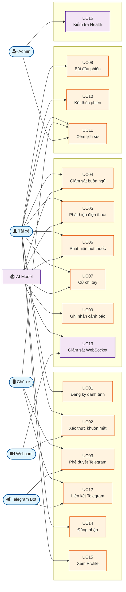

*Sơ đồ tổng quan thể hiện 5 actor chính và 16 use case được phân nhóm theo chức năng: Xác thực, Giám sát, Quản lý phiên và Hệ thống. AI Model đóng vai trò trung tâm trong nhóm giám sát, xử lý song song nhiều loại cảnh báo.*

---

#### UC-02: Sơ đồ Use Case Nhóm Xác thực Danh tính

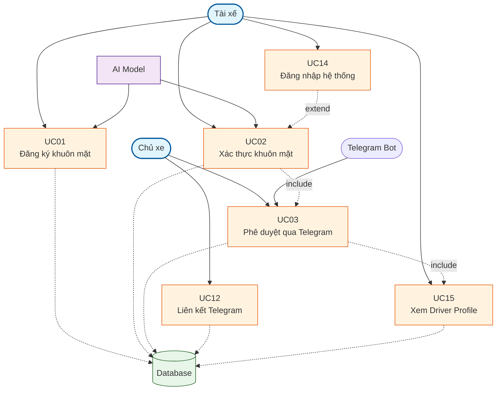

*Sơ đồ chi tiết nhóm Xác thực thể hiện quan hệ: UC02 <<include>> UC03 khi xác thực thất bại, UC14 <<extend>> UC02 (phải đăng nhập trước khi xác thực khuôn mặt), UC12 là tiền điều kiện để UC03 hoạt động.*

---

#### UC-03: Sơ đồ Use Case Nhóm Giám sát Hành vi

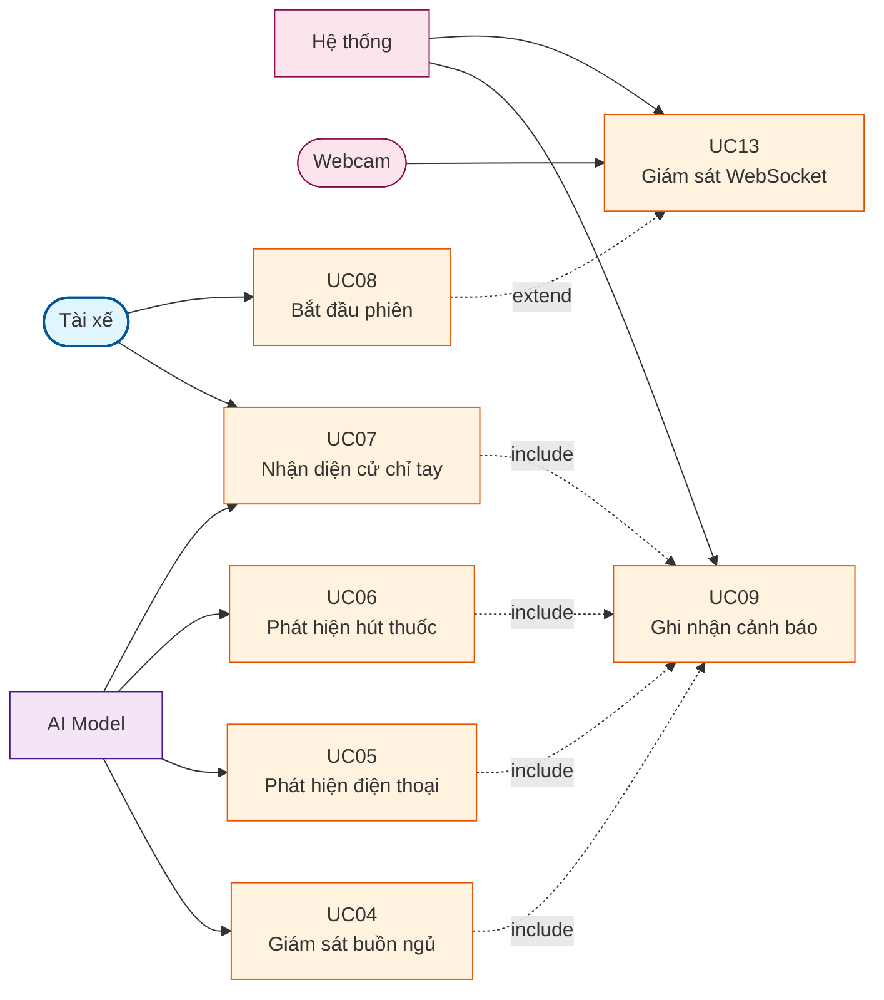

*Sơ đồ nhóm Giám sát: AI Model là actor chính của UC04, UC05, UC06, UC07. Tất cả các UC giám sát đều <<include>> UC09 (Ghi nhận cảnh báo). UC08 <<extend>> UC13 vì bắt đầu phiên sẽ kích hoạt WebSocket real-time.*

### 4.3 ĐẶC TẢ CHI TIẾT USE CASE

#### UC01: Xác thực danh tính tài xế (Face Verification)

| Thuộc tính | Mô tả |
|------------|-------|
| **Tên Use Case** | Xác thực danh tính tài xế |
| **Mã UC** | UC01 |
| **Actor chính** | Tài xế |
| **Actor phụ** | AI Model (MediaPipe Face Mesh), Database (MySQL) |
| **Mô tả tổng quan** | Tài xế thực hiện xác thực danh tính bằng cách cung cấp ảnh chụp từ webcam. Hệ thống trích xuất face embedding và so sánh với embedding đã đăng ký trong database bằng Cosine Similarity. Nếu similarity >= threshold (0.60), tài xế được xác nhận là chính chủ; ngược lại chuyển sang yêu cầu phê duyệt qua Telegram. |
| **Tiền điều kiện** | 1. Tài xế đã đăng ký khuôn mặt trước đó (có record trong driver_identity). <br> 2. Webcam đã được cấp quyền truy cập và hoạt động bình thường. <br> 3. Hệ thống AI đã load model MediaPipe Face Mesh thành công. <br> 4. Kết nối mạng ổn định để gửi request đến backend. |
| **Hậu điều kiện** | 1. Nếu thành công: Tài xế được chuyển đến Dashboard, `is_owner=true` lưu trong state. <br> 2. Nếu thất bại: Hệ thống hiển thị màn hình "Người lạ phát hiện" và gửi yêu cầu đến chủ xe qua Telegram. |
| **Luồng sự kiện chính** | 1. [Tài xế] Nhấn nút "Xác thực danh tính" trên giao diện sau khi đăng nhập. <br> 2. [Hệ thống] Kích hoạt webcam và hiển thị khung hướng dẫn định vị khuôn mặt. <br> 3. [Tài xế] Đưa mặt vào khung hình, hệ thống tự động capture 3-5 frame liên tiếp. <br> 4. [Hệ thống] Chuyển đổi frame thành base64 và gửi POST `/api/auth/verify` với payload `{driver_id, image}`. <br> 5. [AI Model - Backend] MediaPipe Face Mesh trích xuất 468 landmarks từ mỗi frame, tính mean embedding. <br> 6. [Hệ thống] Query database lấy stored_embedding từ bảng driver_identity theo driver_id. <br> 7. [Hệ thướng] Tính Cosine Similarity: `similarity = (stored · current) / (||stored|| × ||current||)`. <br> 8. [Hệ thống] So sánh với threshold (0.60): nếu >= threshold → `is_owner=true`, ngược lại `is_owner=false`. <br> 9. [Hệ thống] Trả về JSON response: `{is_owner, similarity, threshold, samples_used}`. <br> 10. [Hệ thống - Frontend] Nếu `is_owner=true`, hiển thị màn hình chào mừng và cho phép vào Dashboard. <br> 11. [Hệ thống] Nếu `is_owner=false`, chuyển sang UC03 (Phê duyệt qua Telegram). |
| **Luồng ngoại lệ** | **E1: Không phát hiện khuôn mặt trong frame** <br> - Tại bước 5: MediaPipe không detect được face landmarks. <br> - [Hệ thống] Trả về error: "Không detect được khuôn mặt ổn định", yêu cầu tài xế điều chỉnh vị trí. <br><br> **E2: Chưa đăng ký danh tính** <br> - Tại bước 6: Query không tìm thấy driver_id trong driver_identity. <br> - [Hệ thống] Trả về `has_registered=false`, chuyển sang màn hình đăng ký khuôn mặt (UC01). <br><br> **E3: Database connection lỗi** <br> - Tại bước 6: Không kết nối được MySQL. <br> - [Hệ thống] Trả về HTTP 500, log lỗi server, hiển thị thông báo "Hệ thống đang bảo trì". |
| **Yêu cầu phi chức năng** | 1. **Hiệu năng**: Thời gian xử lý một request xác thực <= 500ms (MediaPipe inference + DB query + similarity calculation). <br> 2. **Độ chính xác**: Tỷ lệ chính xác trong việc phân biệt chính chủ/người lạ >= 95% (tested với 100+ samples). <br> 3. **Bảo mật**: Embedding vectors không bao giờ được lưu ở client-side, chỉ lưu trong database server. <br> 4. **Sẵn sàng**: Hệ thống phải xử lý được ít nhất 10 request xác thực đồng thời. |

#### UC02: Giám sát hành vi nguy hiểm real-time

| Thuộc tính | Mô tả |
|------------|-------|
| **Tên Use Case** | Giám sát hành vi nguy hiểm real-time |
| **Mã UC** | UC02 |
| **Actor chính** | AI Model (ML Pipeline) |
| **Actor phụ** | Tài xế, Database, Alert System |
| **Mô tả tổng quan** | Trong suốt phiên lái xe, hệ thống liên tục phân tích video stream từ webcam để phát hiện các hành vi nguy hiểm: buồn ngủ (drowsiness), sử dụng điện thoại (phone usage), hút thuốc (smoking), và cử chỉ tay bất thường. Khi phát hiện, hệ thống phát cảnh báo âm thanh, hiển thị overlay trên dashboard, và tăng counter cảnh báo trong database. |
| **Tiền điều kiện** | 1. Phiên lái xe đã được bắt đầu (UC08), có `session_id` hợp lệ. <br> 2. Webcam đang hoạt động và cung cấp video stream ổn định (min 15 FPS). <br> 3. Tất cả model ML đã load thành công: landmark_model, smoking_model, phone_model, hand_model. <br> 4. WebSocket connection đã thiết lập giữa frontend và backend. |
| **Hậu điều kiện** | 1. Các cảnh báo được ghi nhận trong `driving_session_alerts` với đúng `session_id` và `alert_type`. <br> 2. Dashboard hiển thị real-time số lần cảnh báo mỗi loại. <br> 3. Nếu hành vi nguy hiểm kéo dài, tài xế nhận được cảnh báo âm thanh liên tục. |
| **Luồng sự kiện chính** | 1. [Hệ thống] Frontend thiết lập intervals: Face detection mỗi 1000ms, Hand detection mỗi 150ms. <br> 2. [Hệ thống] Capture frame từ webcam, chuyển thành base64 image. <br> 3. [Hệ thống] Gửi frame qua WebSocket (`phone_frame`, `smoking_frame`) hoặc REST API (`/api/monitor/face`, `/api/monitor/hand`). <br> 4. [AI Model - Backend] Nhận frame, decode base64 sang OpenCV image. <br> 5. [AI Model] **Face Detection**: MediaPipe Face Mesh trích 468 landmarks → MLPClassifier dự đoán label ('safe', 'drowsy', 'no_face'). <br> 6. [AI Model] **Phone Detection (YOLO)**: YOLOv8 chạy object detection, trả về bounding boxes nếu confidence >= 0.4. <br> 7. [AI Model] **Smoking Detection**: Face landmarks → smoking_model.pkl, trả 'smoking' nếu confidence >= 0.90. <br> 8. [AI Model] **Hand Detection**: MediaPipe Hands trích 21 landmarks → hand_model.pkl phân loại ký hiệu. <br> 9. [Hệ thống] Áp dụng hysteresis: cần 2-3 frame liên tiếp cùng label mới trigger cảnh báo. <br> 10. [Hệ thống] Nếu xác nhận hành vi nguy hiểm: phát âm thanh cảnh báo (Audio API), hiển thị overlay trên dashboard. <br> 11. [Hệ thống] POST `/api/session/alert` với `{session_id, alert_type, delta=1}` để tăng counter. <br> 12. [Database] INSERT/UPDATE `driving_session_alerts` table. <br> 13. [Hệ thống] Dashboard cập nhật UI real-time với số liệu mới. <br> 14. [Hệ thống] Lặp lại từ bước 2 cho đến khi tài xế kết thúc phiên. |
| **Luồng ngoại lệ** | **E1: Model chưa load hoặc lỗi inference** <br> - Tại bước 5-8: Model = None hoặc exception trong predict(). <br> - [Hệ thống] Trả về error response, log lỗi, hiển thị "Model unavailable" trên dashboard nhưng không dừng giám sát. <br><br> **E2: Không phát hiện khuôn mặt/tay trong frame** <br> - MediaPipe trả về None landmarks. <br> - [Hệ thống] Bỏ qua frame này, tiếp tục với frame tiếp theo, không trigger cảnh báo. <br><br> **E3: WebSocket disconnect** <br> - Mất kết nối mạng giữa phiên. <br> - [Hệ thống] Socket.IO tự động reconnect với exponential backoff, trong thời gian chờ thì dùng REST API fallback. |
| **Yêu cầu phi chức năng** | 1. **Latency**: Thời gian từ capture frame đến nhận kết quả detection <= 300ms (real-time requirement). <br> 2. **Throughput**: Hệ thống xử lý được tối thiểu 10 FPS cho face detection và 6 FPS cho hand detection. <br> 3. **Precision/Recall**: Phone detection: Precision >= 85%, Recall >= 80%; Smoking detection: Precision >= 90%. <br> 4. **Resource**: CPU usage < 70% trên máy chủ 4 cores khi xử lý 5 streams đồng thời. |

#### UC03: Phê duyệt xác thực qua Telegram

| Thuộc tính | Mô tả |
|------------|-------|
| **Tên Use Case** | Phê duyệt xác thực qua Telegram |
| **Mã UC** | UC03 |
| **Actor chính** | Chủ xe |
| **Actor phụ** | Telegram Bot, Hệ thống (Backend), Database |
| **Mô tả tổng quan** | Khi xác thực khuôn mặt thất bại (similarity < threshold), hệ thống tự động gửi thông báo đến chủ xe qua Telegram Bot. Chủ xe nhận được tin nhắn có ảnh snapshot của người đang cố mở khóa và 2 nút "Chấp nhận" / "Từ chối". Quyết định của chủ xe được ghi nhận và cập nhật real-time trên hệ thống. |
| **Tiền điều kiện** | 1. Xác thực khuôn mặt thất bại (UC01 trả về `is_owner=false`). <br> 2. Chủ xe đã liên kết Telegram với xe (có record trong `driver_telegram_owner`). <br> 3. `TELEGRAM_BOT_TOKEN` và `TELEGRAM_WEBHOOK_SECRET` đã cấu hình. <br> 4. Webhook URL đã được đăng ký với Telegram API. |
| **Hậu điều kiện** | 1. Nếu Accept: Tài xế được chuyển sang Dashboard, status trong `identity_decision_requests` = 'accepted'. <br> 2. Nếu Reject: Hệ thống hiển thị màn hình khóa với thông báo "Owner Rejected", không cho phép tiếp tục. <br> 3. Nếu hết thời gian (timeout): Status = 'expired', yêu cầu xác thực lại. |
| **Luồng sự kiện chính** | 1. [Hệ thống] Sau khi UC01 trả về `is_owner=false`, tự động gọi `/api/auth/request_decision` với `phase=auth`. <br> 2. [Hệ thống] Backend query `driver_telegram_owner` lấy `telegram_chat_id` của chủ xe. <br> 3. [Hệ thống] Tạo record trong `identity_decision_requests`: status='pending', expires_at=now+120s. <br> 4. [Telegram Bot] Gửi tin nhắn đến `chat_id` kèm: ảnh snapshot, thông báo "Phát hiện người lạ", 2 inline buttons (Accept/Reject). <br> 5. [Chủ xe] Nhận thông báo trên điện thoại, xem ảnh và nhấn "Chấp nhận" hoặc "Từ chối". <br> 6. [Telegram Bot] Gửi callback query `idr:accept:<request_id>` hoặc `idr:reject:<request_id>` đến webhook. <br> 7. [Hệ thống] Webhook `/api/telegram/webhook` nhận callback, xác thực `chat_id` khớp với request. <br> 8. [Hệ thống] Cập nhật `identity_decision_requests`: status='accepted'/'rejected', decided_at=now, decided_by_chat_id. <br> 9. [Hệ thống] Trả về answer callback cho Telegram: "Đã ghi nhận lựa chọn". <br> 10. [Tài xế] Frontend polling `/api/auth/decision_status` phát hiện status thay đổi, chuyển màn hình tương ứng. |
| **Luồng ngoại lệ** | **E1: Chưa liên kết Telegram** <br> - Tại bước 2: Không tìm thấy record trong `driver_telegram_owner`. <br> - [Hệ thống] Trả về error: "Chưa bind Telegram chat_id", hiển thị hướng dẫn liên kết Telegram. <br><br> **E2: Timeout - Chủ xe không phản hồi** <br> - Sau 120 giây (mặc định) không có callback. <br> - [Hệ thống] Polling phát hiện `expires_at <= now`, tự động update status='expired'. <br> - [Hệ thống] Hiển thị màn hình "Yêu cầu hết hạn, vui lòng thử lại". <br><br> **E3: Telegram API lỗi** <br> - Tại bước 4: Không gửi được tin nhắn (network error, bot blocked). <br> - [Hệ thống] Catch exception, update status='expired' với reason='telegram_error', trả về lỗi cho frontend. |
| **Yêu cầu phi chức năng** | 1. **Thời gian phản hồi**: Từ khi chủ xe nhấn nút đến khi hệ thống cập nhật <= 2 giây (webhook processing). <br> 2. **Độ tin cậy**: Telegram Bot API có 99.9% uptime, hỗ trợ retry mechanism nếu gửi thất bại. <br> 3. **Bảo mật**: Webhook secret token để xác thực request thực sự từ Telegram, chống spoofing. |

### 4.4 SƠ ĐỒ HOẠT ĐỘNG (ACTIVITY DIAGRAM)

#### AD01 - Quy trình đăng nhập và xác thực khuôn mặt

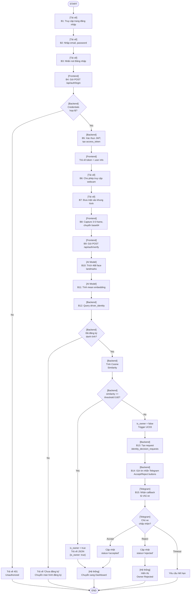

*Sơ đồ hoạt động AD01 thể hiện luồng đăng nhập và xác thực khuôn mặt với 4 điểm quyết định chính: (1) Credentials hợp lệ, (2) Đã đăng ký danh tính, (3) Face similarity >= 0.60, (4) Chủ xe chấp nhận qua Telegram.*

---

#### AD02 - Quy trình giám sát hành vi real-time

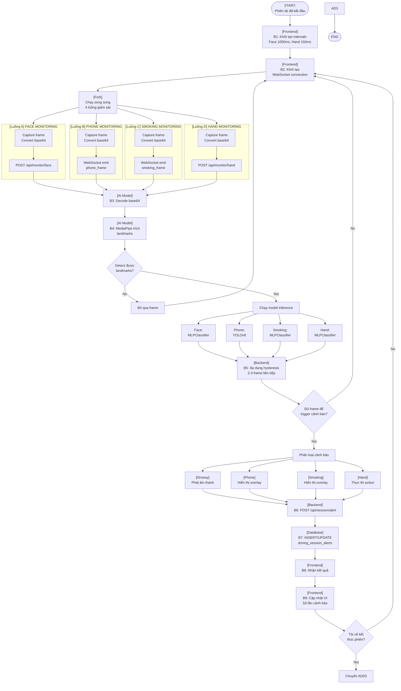

*Sơ đồ AD02 thể hiện 4 luồng giám sát song song (Face, Phone/YOLO, Smoking, Hand). Mỗi luồng độc lập xử lý và đều đi qua hysteresis filter trước khi trigger cảnh báo. Vòng lặp tiếp tục cho đến khi tài xế kết thúc phiên.*

---

#### AD03 - Quy trình kết thúc phiên và xem lịch sử

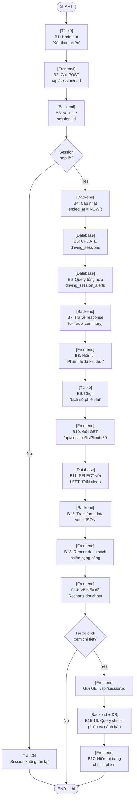

*Sơ đồ AD03 thể hiện 17 bước từ kết thúc phiên đến xem lịch sử. Hai điểm quyết định chính: (1) Session hợp lệ để cập nhật, (2) Tài xế có muốn xem chi tiết 1 phiên cụ thể.*

### 4.5 SƠ ĐỒ TUẦN TỰ (SEQUENCE DIAGRAM)

#### SD01 - Luồng xác thực danh tính tài xế

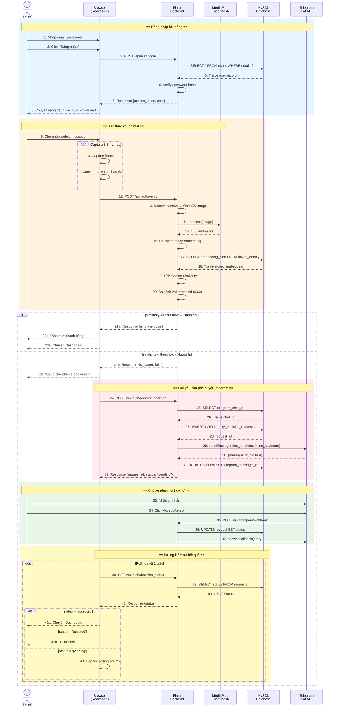

*Sơ đồ SD01 thể hiện 3 section: Đăng nhập → Xác thực khuôn mặt → Phê duyệt Telegram. Sử dụng alt/else cho nhánh Chính chủ/Người lạ, loop cho polling kiểm tra kết quả.*

---

#### SD02 - Luồng phát hiện hành vi nguy hiểm real-time qua WebSocket

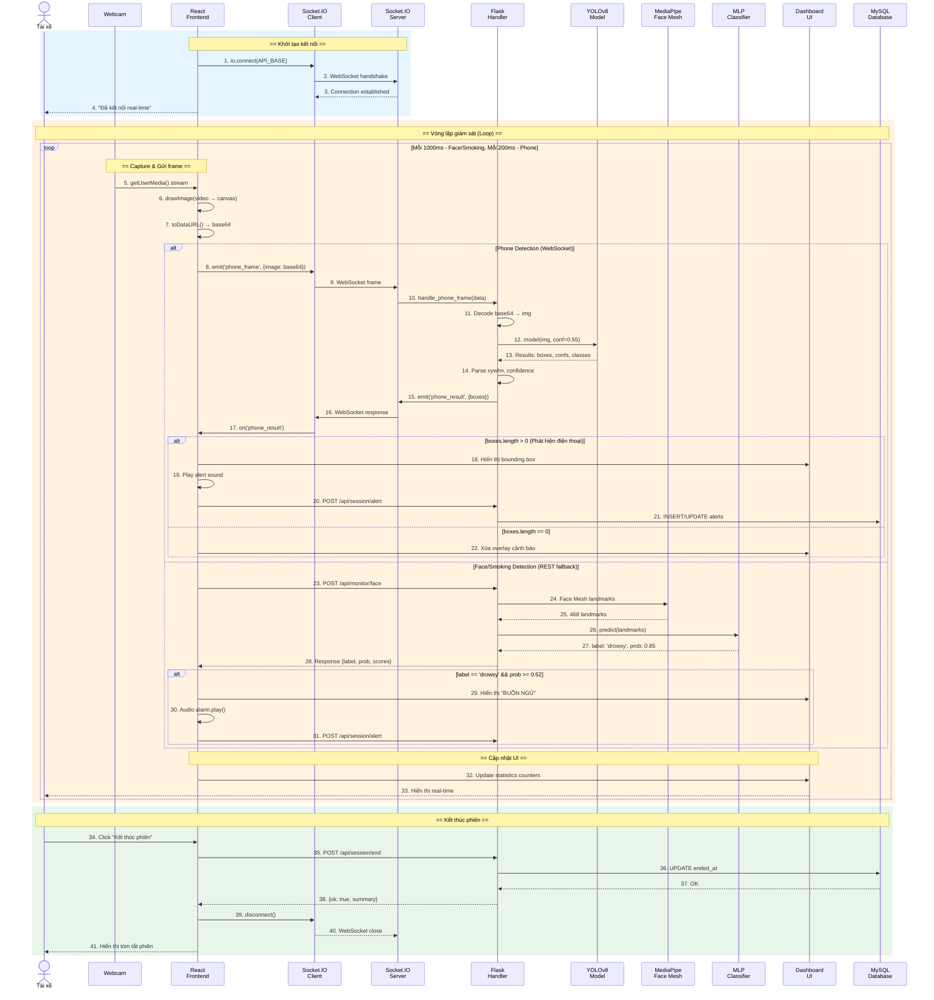

*Sơ đồ SD02 với 11 participant: Webcam → React → Socket.IO → Flask → AI Models → Dashboard → MySQL. Sử dụng loop cho vòng lặp giám sát, alt/else cho nhánh Phone Detection vs Face/Smoking.*

---

#### SD03 - Luồng kết thúc phiên lái xe và lưu log

**Mô tả chi tiết các message:**

| Step | Từ | Đến | Message | Dữ liệu |
|------|-----|-----|---------|---------|
| 1 | Tài xế | React Frontend | Click "Kết thúc phiên" | - |
| 2 | React | React | Confirm dialog | "Bạn chắc chắn?" |
| 3 | Tài xế | React | Xác nhận | - |
| 4 | React | Flask Backend | POST /api/session/end | `{session_id}` |
| 5-6 | Flask | Flask | Parse & Validate | `session_id` (int) |
| 7 | Flask | MySQL | SELECT | `WHERE id=? AND ended_at IS NULL` |
| 8 | MySQL | Flask | Return row | Record hoặc empty |
| 9-14 | Flask | React | Response | `{ok: true, summary}` |
| 15 | React | Tài xế | Hiển thị | "Phiên lái đã kết thúc" |
| 16 | Tài xế | React | Click "Lịch sử" | - |
| 18 | React | Flask | GET /api/session/list | `?limit=30` |
| 19 | Flask | MySQL | SELECT + LEFT JOIN | `driving_sessions` + `alerts` |
| 22 | Flask | React | Response | Danh sách phiên |
| 23 | React | Charts | Render DoughnutChart | Dữ liệu alerts |
| 27 | React | Flask | GET /api/session/123 | `session_id` |
| 28-31 | Flask | MySQL | SELECT chi tiết | Session + Alerts |
| 32 | Flask | React | Response | Chi tiết phiên |
| 33 | React | Tài xế | Hiển thị modal | Timeline cảnh báo |

**Chi tiết các API trong SD03:**

| API | Method | Request | Response | Database Operation |
|-----|--------|---------|----------|------------------|
| /api/session/end | POST | `{session_id: 123}` | `{ok: true, ended_at}` | UPDATE ended_at |
| /api/session/list | GET | `?limit=30&driver_id=xxx` | `{sessions: [...]}` | SELECT + JOIN |
| /api/session/<id> | GET | URL param | `{session_id, alerts}` | 2x SELECT |

### 4.6 SƠ ĐỒ LỚP (CLASS DIAGRAM)

Dựa trên phân tích source code backend, hệ thống DMS có các lớp (class) chính sau. Lưu ý: Do sử dụng Flask với raw SQL thay vì ORM đầy đủ, các "class" ở đây đại diện cho các entities logic và utility classes:

#### Danh sách các Class chính

| STT | Class/Entity | Loại | Mô tả |
|-----|--------------|------|-------|
| 1 | DriverIdentity | Entity | Lưu thông tin đăng ký khuôn mặt tài xế |
| 2 | DriverTelegramOwner | Entity | Liên kết tài xế với Telegram chat |
| 3 | IdentityDecisionRequest | Entity | Yêu cầu phê duyệt xác thực |
| 4 | DrivingSession | Entity | Phiên lái xe |
| 5 | DrivingSessionAlert | Entity | Cảnh báo trong phiên |
| 6 | AuthController | Controller | Xử lý đăng nhập, JWT |
| 7 | IdentityController | Controller | Xử lý đăng ký/xác thực khuôn mặt |
| 8 | MonitorController | Controller | Xử lý giám sát hành vi |
| 9 | SessionController | Controller | Quản lý phiên lái xe |
| 10 | TelegramController | Controller | Xử lý webhook Telegram |
| 11 | ModelLoader | Service | Load các ML model |
| 12 | MediaPipeService | Service | Trích xuất landmarks |
| 13 | DatabaseConnection | Utility | Quản lý kết nối MySQL |
| 14 | SocketIOHandler | Service | Xử lý WebSocket events |

#### Chi tiết từng Class

**1. Class DriverIdentity**

```
┌─────────────────────────────────────────────────────┐
│ DriverIdentity                                      │
├─────────────────────────────────────────────────────┤
│ - driver_id: String (PK)                          │
│ - name: String                                      │
│ - embedding_json: Text (JSON)                      │
│ - image_base64: Text                                │
│ - created_at: DateTime                              │
├─────────────────────────────────────────────────────┤
│ + register(driver_id, images): DriverIdentity      │
│ + verify(driver_id, image): VerificationResult   │
│ + getProfile(driver_id): DriverProfile             │
│ + updateEmbedding(embedding): void                  │
└─────────────────────────────────────────────────────┘
```

**2. Class DriverTelegramOwner**

```
┌─────────────────────────────────────────────────────┐
│ DriverTelegramOwner                                 │
├─────────────────────────────────────────────────────┤
│ - id: Integer (PK, Auto)                           │
│ - driver_id: String (FK → DriverIdentity)         │
│ - telegram_chat_id: BigInteger                      │
│ - telegram_user_id: BigInteger                      │
│ - created_at: DateTime                              │
│ - updated_at: DateTime                              │
├─────────────────────────────────────────────────────┤
│ + bind(driver_id, chat_id, user_id): Boolean       │
│ + getChatId(driver_id): BigInteger                   │
│ + unbind(driver_id): Boolean                       │
└─────────────────────────────────────────────────────┘
```

**3. Class IdentityDecisionRequest**

```
┌─────────────────────────────────────────────────────┐
│ IdentityDecisionRequest                             │
├─────────────────────────────────────────────────────┤
│ - request_id: Integer (PK, Auto)                   │
│ - driver_id: String (FK → DriverIdentity)           │
│ - status: Enum ['pending', 'accepted', 'rejected', 'expired'] │
│ - reason: String                                      │
│ - similarity: Float                                 │
│ - threshold: Float                                  │
│ - requested_at: DateTime                            │
│ - expires_at: DateTime                              │
│ - decided_at: DateTime                              │
│ - telegram_chat_id: BigInteger                      │
│ - telegram_message_id: BigInteger                   │
│ - decided_by_chat_id: BigInteger                    │
├─────────────────────────────────────────────────────┤
│ + create(driver_id, timeout): request_id           │
│ + updateStatus(request_id, status): Boolean         │
│ + getStatus(request_id): Status                      │
│ + isExpired(): Boolean                             │
└─────────────────────────────────────────────────────┘
```

**4. Class DrivingSession**

```
┌─────────────────────────────────────────────────────┐
│ DrivingSession                                      │
├─────────────────────────────────────────────────────┤
│ - id: Integer (PK, Auto)                           │
│ - driver_id: String (FK → DriverIdentity)           │
│ - label: String                                     │
│ - started_at: DateTime                              │
│ - ended_at: DateTime (nullable)                     │
├─────────────────────────────────────────────────────┤
│ + start(driver_id, label): session_id              │
│ + end(session_id): Boolean                         │
│ + getDuration(): Integer (seconds)                 │
│ + isActive(): Boolean                              │
│ + listByDriver(driver_id, limit): Session[]        │
└─────────────────────────────────────────────────────┘
```

**5. Class DrivingSessionAlert**

```
┌─────────────────────────────────────────────────────┐
│ DrivingSessionAlert                                 │
├─────────────────────────────────────────────────────┤
│ - session_id: Integer (FK → DrivingSession, PK part)│
│ - alert_type: Enum ['phone', 'smoking', 'drowsy', 'seatbelt', 'generic'] (PK part) │
│ - count: Integer (default: 0)                     │
├─────────────────────────────────────────────────────┤
│ + increment(session_id, alert_type, delta): total  │
│ + getCount(session_id, alert_type): Integer        │
│ + getAllBySession(session_id): Alert[]             │
│ + getSummary(session_id): Map<String, Integer>     │
└─────────────────────────────────────────────────────┘
```

**6. Class ModelLoader (Service)**

```
┌─────────────────────────────────────────────────────┐
│ ModelLoader                                         │
├─────────────────────────────────────────────────────┤
│ - landmark_model: sklearn.Pipeline                  │
│ - hand_model: sklearn.Pipeline                      │
│ - smoking_model: sklearn.Pipeline                   │
│ - phone_model: sklearn.Pipeline                     │
│ - phone_yolo_model: YOLO                            │
│ - idx_to_label: Dict<Integer, String>               │
│ - hand_idx_to_label: Dict<Integer, String>          │
├─────────────────────────────────────────────────────┤
│ + loadModels(): void                                │
│ + predictLandmark(landmarks): Prediction           │
│ + predictHand(landmarks): Prediction               │
│ + predictSmoking(landmarks): Prediction            │
│ + predictPhone(image): Prediction                   │
│ + detectPhoneYOLO(image): BoundingBox[]              │
│ + getLabels(): String[]                             │
└─────────────────────────────────────────────────────┘
```

**7. Class MediaPipeService**

```
┌─────────────────────────────────────────────────────┐
│ MediaPipeService                                    │
├─────────────────────────────────────────────────────┤
│ - face_mesh: mp.solutions.face_mesh.FaceMesh       │
│ - hands: mp.solutions.hands.Hands                   │
├─────────────────────────────────────────────────────┤
│ + extractFaceLandmarks(image): Float[468]          │
│ + extractHandLandmarks(image): Float[63]           │
│ + calculateEAR(landmarks): Float (Eye Aspect Ratio)│
│ + normalizeLandmarks(landmarks): Float[]            │
│ + imageToLandmarks(base64): Float[]                 │
└─────────────────────────────────────────────────────┘
```

#### Mối quan hệ giữa các Class

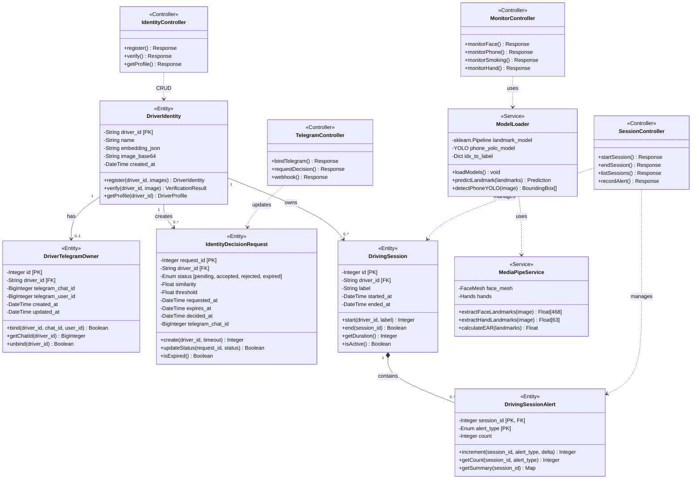

*Sơ đồ lớp thể hiện 14 class với stereotypes: <<Entity>> cho các lớp dữ liệu chính, <<Service>> cho xử lý nghiệp vụ, <<Controller>> cho xử lý request. Mối quan hệ bao gồm: Association (-->), Composition (*--), và Dependency (..>).*

**Chi tiết các mối quan hệ:**

| Quan hệ | Class A | Class B | Loại | Mô tả |
|---------|---------|---------|------|-------|
| 1-1 | DriverIdentity | DriverTelegramOwner | Optional | 1 tài xế có thể có 0 hoặc 1 liên kết Telegram |
| 1-N | DriverIdentity | IdentityDecisionRequest | Composition | 1 tài xế có nhiều yêu cầu phê duyệt theo thời gian |
| 1-N | DriverIdentity | DrivingSession | Aggregation | 1 tài xế có nhiều phiên lái xe |
| 1-N | DrivingSession | DrivingSessionAlert | Composition | 1 phiên có nhiều cảnh báo (có thể không có) |
| Sử dụng | MonitorController | ModelLoader | Dependency | Controller sử dụng service để inference |
| Sử dụng | ModelLoader | MediaPipeService | Dependency | ModelLoader gọi MediaPipe để trích landmarks |
| Kế thừa | ModelLoader | sklearn.BaseEstimator | Inheritance | Kế thừa từ scikit-learn (conceptual) |

### 4.7 KIẾN TRÚC HỆ THỐNG

#### 4.7.1 Mô hình kiến trúc tổng thể

Hệ thống AI Driver Monitoring System được thiết kế theo mô hình **Client-Server Architecture** kết hợp với **Layered Architecture**. Hệ thống được chia thành các tầng (layer) rõ ràng, mỗi tầng có trách nhiệm cụ thể và giao tiếp với tầng trên/dưới thông qua well-defined interfaces.

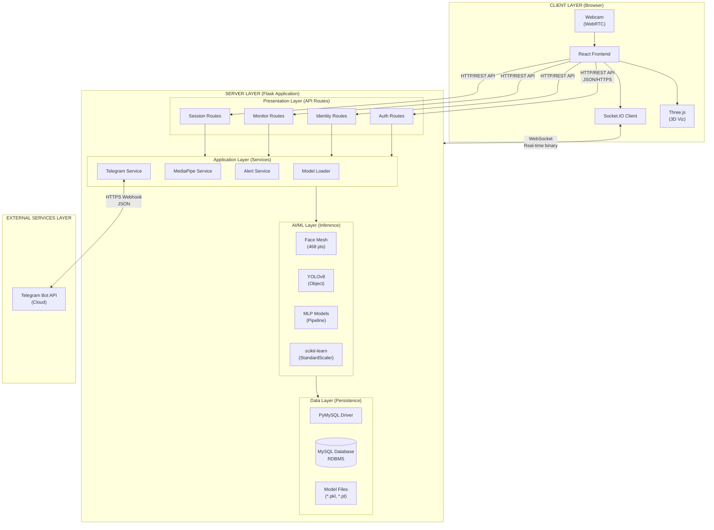

*Sơ đồ kiến trúc Client-Server với 5 tầng: Client (Browser), Presentation (API Routes), Application (Services), AI/ML (Inference), Data (Persistence), và External (Telegram). Giao tiếp qua HTTP/REST API và WebSocket.*

#### 4.7.2 Các tầng kiến trúc chi tiết

**Tầng 1: Presentation Layer (Client-Side)**

| Thành phần | Công nghệ | Vai trò |
|------------|-----------|---------|
| Webcam Access | WebRTC getUserMedia | Thu hình video real-time từ camera |
| React Frontend | React 19, Vite | Render UI, quản lý state, routing |
| MediaPipe Client | @mediapipe libraries | Pre-processing trước khi gửi server |
| Socket.IO Client | socket.io-client | Giao tiếp real-time với server |
| Visualization | Three.js, Recharts | Hiển thị 3D model, biểu đồ thống kê |

**Tầng 2: API Gateway / Routes (Server-Side)**

| Module | File | Chức năng |
|--------|------|-----------|
| Auth Routes | auth_routes.py | Đăng nhập, đăng ký, JWT management |
| Identity Routes | routes_identity.py | Đăng ký/xác thực khuôn mặt, Telegram binding |
| Monitor Routes | monitor_routes.py, routes_prediction.py | Face, hand, smoking, phone detection APIs |
| Session Routes | session_routes.py, routes_driving.py | Quản lý phiên lái, cảnh báo, log |
| WebSocket Handlers | socket_handlers.py | Real-time phone/smoking detection |

**Tầng 3: Application Services**

| Service | Chức năng |
|---------|-----------|
| ModelLoader | Load và cache các model ML từ file .pkl và .pt |
| MediaPipeService | Trích xuất landmarks từ ảnh bằng MediaPipe |
| AlertService | Xử lý logic cảnh báo, hysteresis, throttling |
| TelegramService | Gửi/nhận message qua Telegram Bot API |
| AuthService | Verify JWT tokens, quản lý permissions |

**Tầng 4: AI/ML Layer**

| Component | Input | Output | Algorithm |
|-----------|-------|--------|-----------|
| Face Mesh | RGB Image | 468 landmarks (x,y,z) | MediaPipe Face Mesh |
| Hands | RGB Image | 21 landmarks (x,y,z) | MediaPipe Hands |
| Drowsiness Classifier | 468 landmarks | Label: safe/drowsy | MLP (256,128) + StandardScaler |
| Smoking Classifier | 468 landmarks | Label: smoking/no_smoking | MLP + StandardScaler |
| Phone Detector (Landmark) | 468 landmarks | Label: phone/no_phone | MLP + StandardScaler |
| Phone Detector (YOLO) | RGB Image | Bounding boxes | YOLOv8n (pretrained + fine-tuned) |
| Hand Gesture Classifier | 63 normalized landmarks | Label: thumbs_up/open_palm/... | MLP (128,64) |

**Tầng 5: Data Persistence Layer**

| Component | Technology | Mục đích |
|-----------|------------|----------|
| Database | MySQL 8.0 | Lưu user profiles, sessions, alerts, decisions |
| Connection Pool | SQLAlchemy + PyMySQL | Quản lý kết nối, connection pooling |
| Model Storage | Filesystem (.pkl, .pt) | Lưu trữ model weights |
| Cache | In-memory (Flask globals) | Cache loaded models, label mappings |

#### 4.7.3 Luồng dữ liệu (Data Flow)

**Luồng 1: Real-time Face Monitoring (Drowsiness Detection)**

```mermaid
flowchart LR
    A["Webcam<br/>getUserMedia()"] --> B["Canvas<br/>toDataURL"]
    B --> C["POST /api/monitor/face<br/>{image: base64}"]
    C --> D["Flask Backend<br/>base64.b64decode"]
    D --> E["OpenCV image<br/>numpy array"]
    E --> F["MediaPipe Face Mesh<br/>468 landmarks"]
    F --> G["Feature vector<br/>[1, 1404]"]
    G --> H["MLPClassifier<br/>StandardScaler → 256 → 128"]
    H --> I["Prediction<br/>{label, prob, scores}"]
    I --> J["React Dashboard<br/>Update UI"]
    J --> K["Alert Sound<br/>Nếu drowsy"]
    J --> L["POST /api/session/alert"]
    L --> M["MySQL<br/>INSERT/UPDATE alerts"]
    
    classDef hardware fill:#e3f2fd,stroke:#1565c0
    classDef process fill:#fff3e0,stroke:#ef6c00
    classDef data fill:#e8f5e9,stroke:#2e7d32
    classDef alert fill:#ffebee,stroke:#c62828
    
    class A hardware
    class B,D,F,H process
    class C,E,G,I,L data
    class J,K,M alert
```

*Luồng 1 thể hiện quá trình xử lý ảnh khuôn mặt: từ Webcam → Canvas → API → MediaPipe → MLPClassifier → Kết quả → UI và Database.*

**Luồng 2: Phone Detection via WebSocket (YOLO)**

```mermaid
flowchart LR
    A["Webcam<br/>Capture 200ms"] --> B["Canvas<br/>Convert base64"]
    B --> C["Socket.IO<br/>emit phone_frame"]
    C --> D["Server<br/>handle_phone_frame"]
    D --> E["YOLOv8<br/>conf=0.55"]
    E --> F["Parse xywhn<br/>Bounding boxes"]
    F --> G["Socket.IO<br/>emit phone_result"]
    G --> H["React<br/>Nhận kết quả"]
    H --> I{"boxes.length<br/>> 0?"}
    I -->|Yes| J["Show overlay<br/>PHONE DETECTED"]
    I -->|No| K["Xóa overlay"]
    J --> L["POST /api/session/alert"]
    
    classDef webcam fill:#e3f2fd,stroke:#1565c0
    classDef socket fill:#f3e5f5,stroke:#6a1b9a
    classDef ai fill:#fff3e0,stroke:#ef6c00
    classDef ui fill:#e8f5e9,stroke:#2e7d32
    classDef alert fill:#ffebee,stroke:#c62828
    
    class A webcam
    class B,C,D,G,F socket
    class E ai
    class H,I,J,K ui
    class L alert
```

*Luồng 2 sử dụng WebSocket cho real-time phone detection: Webcam → Socket.IO → YOLOv8 → Socket.IO → React Overlay. Latency thấp hơn REST API (~100ms).*

**Luồng 3: Identity Verification → Telegram Approval**

```mermaid
flowchart LR
    A["POST /api/auth/verify"] --> B["MediaPipe<br/>Face embedding"]
    B --> C["Cosine Similarity<br/>vs stored"]
    C --> D{"similarity >=<br/>threshold 0.60?"}
    D -->|Yes| E["is_owner=true<br/>Vào Dashboard"]
    D -->|No| F["is_owner=false<br/>Trigger Telegram"]
    F --> G["POST /request_decision"]
    G --> H["Query<br/>driver_telegram_owner"]
    H --> I["Telegram API<br/>sendPhoto + inline_keyboard"]
    I --> J["Chủ xe<br/>Mobile App"]
    J --> K["Click Accept"]
    K --> L["POST /telegram/webhook<br/>callback_query"]
    L --> M["UPDATE<br/>status='accepted'"]
    M --> N["Polling<br/>decision_status"]
    N --> E
    
    classDef api fill:#e3f2fd,stroke:#1565c0
    classDef ai fill:#fff3e0,stroke:#ef6c00
    classDef decision fill:#fce4ec,stroke:#880e4f
    classDef telegram fill:#e8f5e9,stroke:#2e7d32
    classDef success fill:#d1c4e9,stroke:#4527a0
    
    class A,G,L api
    class B,C ai
    class D,F,H,M,N decision
    class I,J,K telegram
    class E success
```

*Luồng 3 thể hiện quy trình xác thực qua Telegram khi không nhận diện được chủ xe: Capture → Verify → Telegram → Approval → Unlock.*

#### 4.7.4 Giao tiếp giữa các thành phần

| Giao tiếp | Protocol | Data Format | Use Case |
|-----------|----------|-------------|----------|
| Frontend ↔ Backend API | HTTP/1.1 or HTTP/2 | JSON | Authentication, CRUD operations |
| Frontend ↔ Backend Real-time | WebSocket (Socket.IO) | Binary (frame) + JSON (result) | Phone/Smoking detection |
| Backend ↔ Telegram | HTTPS REST API | JSON | Send messages, receive webhooks |
| Backend ↔ MySQL | TCP (MySQL Protocol) | SQL + Binary result | Data persistence |
| Frontend ↔ Webcam | WebRTC (getUserMedia) | MediaStream (video) | Capture video |

#### 4.7.5 Vai trò Telegram Bot trong kiến trúc

Telegram Bot đóng vai trò **External Notification & Approval Service** trong kiến trúc:

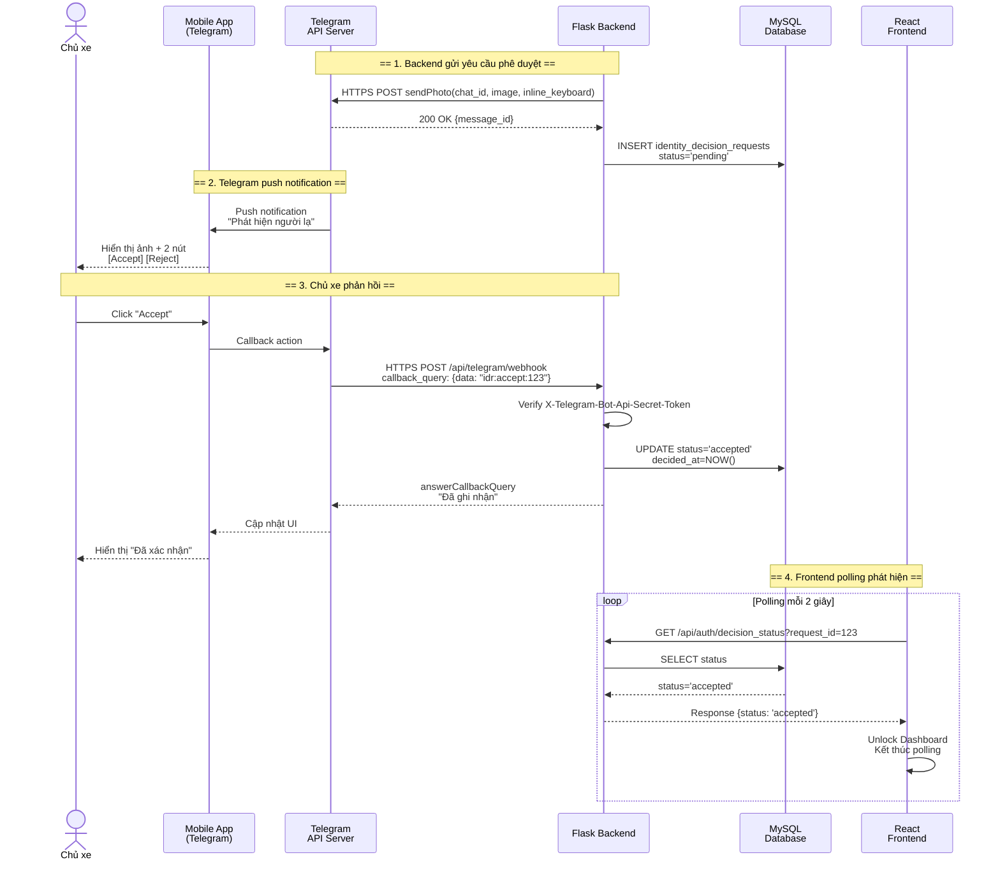

*Sơ đồ sequence thể hiện 4 bước trong Telegram Integration: (1) Backend gửi ảnh qua Telegram API, (2) Push notification đến mobile, (3) Webhook callback khi chủ xe click, (4) Polling cập nhật trạng thái.*

**Security Considerations cho Telegram:**
- `TELEGRAM_WEBHOOK_SECRET` header để xác thực webhook thực sự từ Telegram
- HTTPS-only communication
- Callback query data format: `idr:<action>:<request_id>` để tránh injection
- Chat ID verification: đảm bảo chỉ chủ xe đã bind mới có quyền approve

---

*Hết Chương 4*

